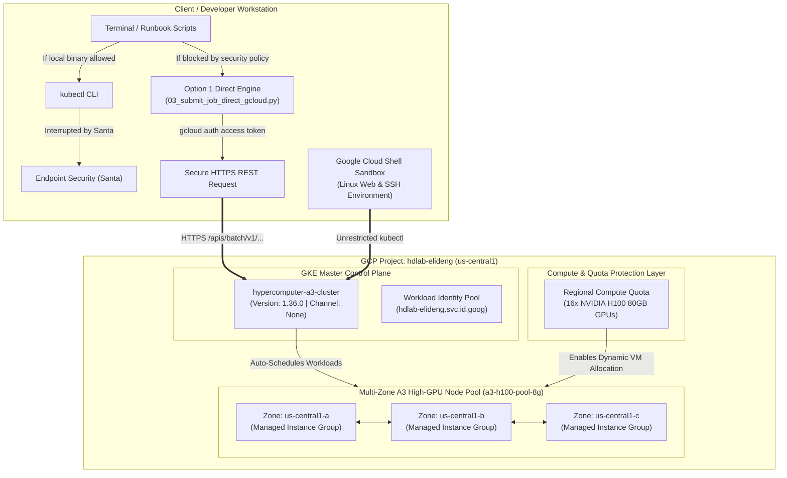
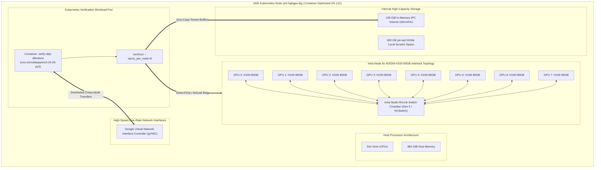
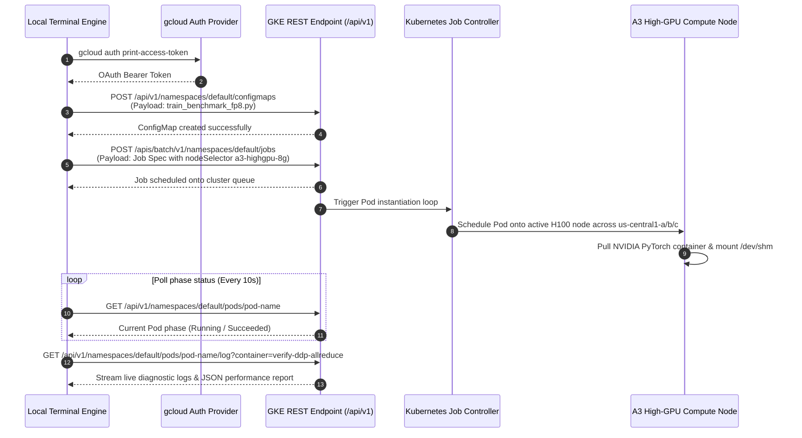

# Google Cloud AI Hypercomputer Cluster Architecture & Topology

This document provides complete system topology diagrams covering the execution pipelines, compute node hardware hierarchies, multi-zone resilient provisioning, and zero-binary REST interaction engines.

---

## 1. High-Level Deployment & Execution Topology

The cluster cleanly separates execution interaction across corporate workstations from remote control planes and scalable high-performance GPU compute tiers across Google Cloud infrastructure.

---

## 2. A3 Node Hardware & Pod Resource Interlock

Each physical `a3-highgpu-8g` compute instance integrates 8 concurrent NVIDIA H100 Tensor Core GPUs linked via high-speed interlocks alongside line-rate Google Virtual NIC (`gVNIC`) attachments.

---

## 3. Option 1: Direct HTTPS REST Execution Flow

This sequence visualizes how [03_submit_job_direct_gcloud.py](file:///Users/elideng/hypercomputer-training-jobs/scripts/03_submit_job_direct_gcloud.py) deploys code, schedules jobs, and streams high-throughput diagnostics without invoking a single local binary blocked by corporate policies.

---

## 4. Summary of Versioning & Quota Configuration Rules

| Configuration Factor | Implemented Setting | Rationale & Protection Target |
| :--- | :--- | :--- |
| **Control Plane Release Channel** | `--release-channel="None"` | Unenrolls cluster from forced auto-upgrade rules to permit custom node version pinning. |
| **Node Pool GKE Version** | `1.33.13-gke.1101000` | Specifically bundles **Container-Optimized OS (COS) 121**, explicitly required by `a3-highgpu-8g`. |
| **Node Pool Auto-Upgrades** | `--no-enable-autoupgrade` | Prevents background tasks from upgrading compute nodes to incompatible `COS 129 / GKE 1.36` kernels. |
| **Regional H100 Quota Limit** | `16` (in `us-central1`) | Allocates sufficient capacity across multiple available availability zones simultaneously. |
| **Node Location Deployment** | `us-central1-a/b/c` | Automatically reroutes node provisioning if any single zone suffers transient hardware stockouts. |
| **IPC POSIX Shared Memory** | `128Gi` (`/dev/shm`) | Eliminates out-of-memory zero-copy tensor crashes during distributed all-reduce operations. |
