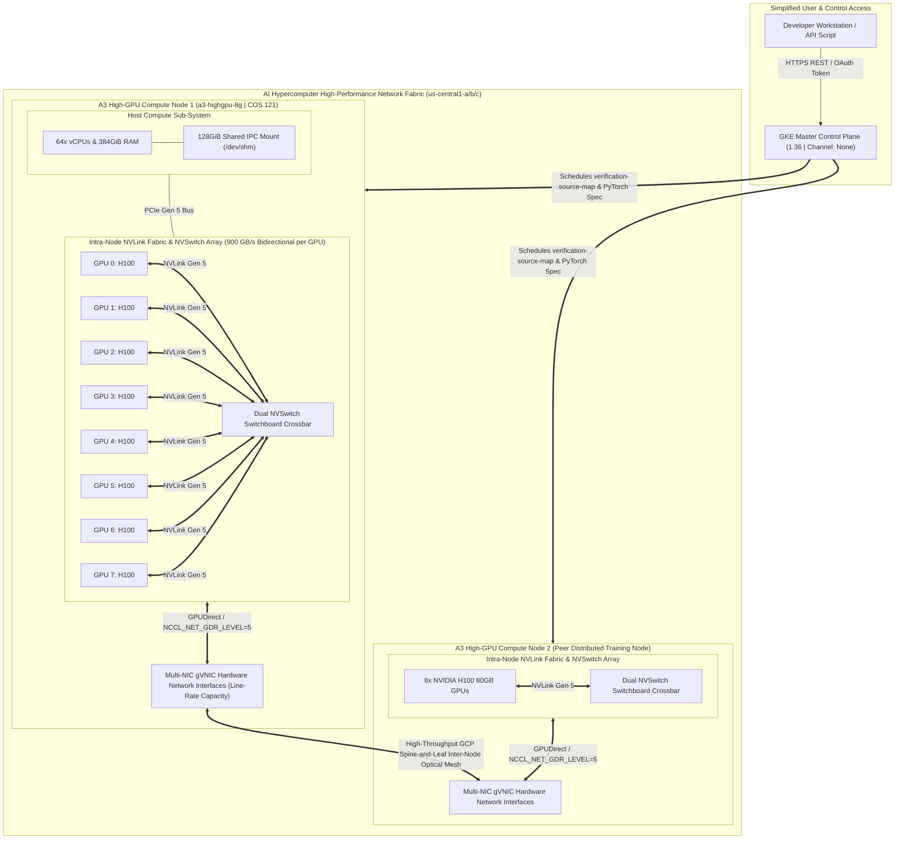
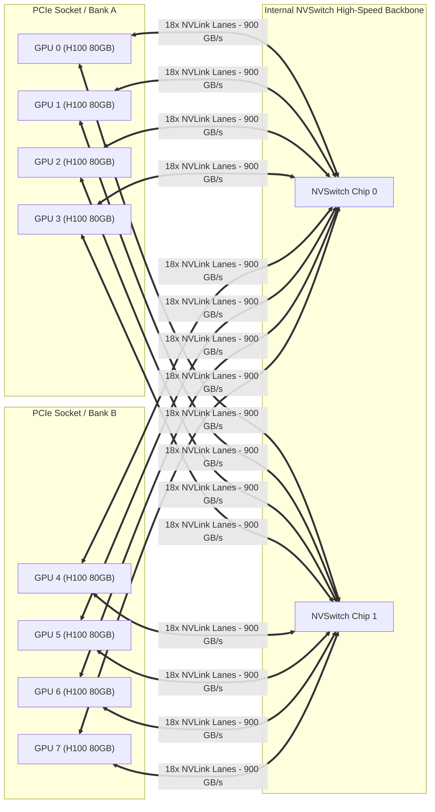
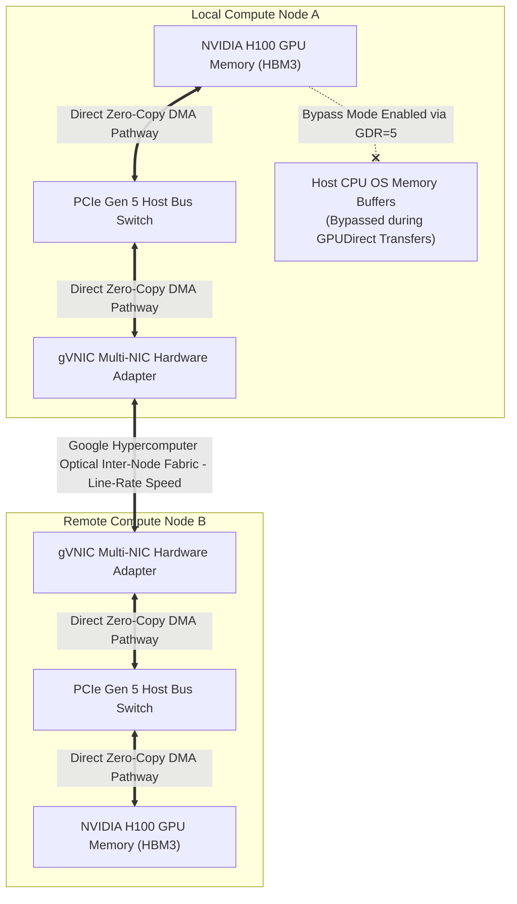
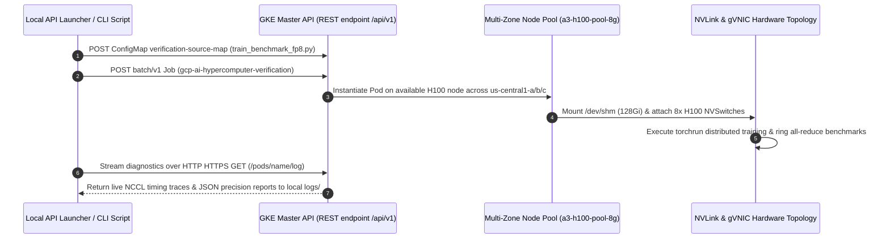

# AI Hypercomputer Network & Hardware Topology Guide

This document defines the physical hardware architecture and network topologies of our **Google Cloud AI Hypercomputer (`a3-highgpu-8g`)** deployment across Google Kubernetes Engine (GKE). It specifically illustrates how multi-GPU distributed workloads achieve low-latency communication via **internal NVLink / NVSwitch crossbars** and **GPUDirect multi-NIC line-rate mesh networks**.

---

## 1. End-to-End Cluster Network Fabric Topology

Our architecture minimizes client access complexity into a simplified API entrypoint while heavily focusing high-throughput network engineering directly inside the node hardware tiers.

---

## 2. Intra-Node NVLink Crossbar & NCCL Ring Topology

Inside each physical 8-GPU node (`a3-highgpu-8g`), distributed all-reduce operations (`torchrun --nproc_per_node=8`) completely bypass host memory busses during tensor ring synchronizations using **NVIDIA Gen 5 NVLink Switch architectures**.

### Technical Highlights:
- **Bandwidth Capacity:** Each individual NVIDIA H100 80GB GPU pushes **900 GB/s** of total bidirectional NVLink bandwidth directly across the internal NVSwitch backplane.
- **Ring Synchronization:** During gradient synchronization steps (`NCCL_ALGORITHM=RING`), data packets flow simultaneously in full concurrent rings (`GPU 0 -> GPU 1 -> GPU 2 -> ... -> GPU 7 -> GPU 0`) across dedicated hardware lanes without inter-socket latency penalties.

---

## 3. GPUDirect Memory Bypass & Line-Rate gVNIC Interlocks

When scaling from a single 8-GPU node to multi-node training clusters (`A3 High / Ultra` or `A4 Blackwell`), network saturation between distinct physical machines is mitigated by enabling **Google Virtual Network Interface Controller (`gVNIC`)** hardware acceleration combined with **NVIDIA GPUDirect (`NCCL_NET_GDR_LEVEL=5`)**.

### Why GPUDirect (`NCCL_NET_GDR_LEVEL=5`) & gVNIC are Critical:
1. **Standard Traditional Network Flow (Legacy Bottleneck):**
   `GPU Memory (HBM3) -> PCIe -> Host CPU System RAM (/dev/shm) -> CPU Network Stack Processing -> Physical Network Adapter -> Wire` *(Requires CPU interrupts and double memory staging pauses)*.
2. **Our GPUDirect Zero-Copy Accelerated Pathway:**
   `GPU Memory (HBM3) <=== Direct DMA PCIe Bus ===> gVNIC Hardware Interface <=== Optical Mesh ===> Peer gVNIC <=== Direct DMA ===> Remote GPU HBM3` *(Zero CPU interruption, minimum micro-second network serialization jitter)*.

---

## 4. Simplified User API & Option 1 Execution Sequence

With network hardware topologies handling computation internally across the cluster, our user interaction model reduces down to straightforward REST endpoints authenticated directly via Google Cloud IAM OAuth.

---

## 5. Summary Matrix of Cluster Network Engineering Tokens

| Parameter Flag / Setting | Applied Target | Architectural Rationale |
| :--- | :--- | :--- |
| **`--accelerator=type=nvidia-h100-80gb,count=8`** | `gcloud container node-pools create` | Attaches exactly 8 full H100 80GB GPUs backed by internal NVLink Gen 5 and dual NVSwitch architectures. |
| **`--enable-gvnic`** | `gcloud container node-pools create` | Activates hardware line-rate Google Virtual NICs (`gVNIC`), delivering maximum packet rates required for multi-node inter-node scaling. |
| **`NCCL_NET_GDR_LEVEL=5`** | `a3_a4_verification_job.yaml` Container Env | Instructs NVIDIA NCCL to use GPUDirect RDMA across direct PCIe-to-network pathways, totally bypassing host CPU RAM copies during cluster exchanges. |
| **`NCCL_ALGORITHM=RING`** | `a3_a4_verification_job.yaml` Container Env | Enforces deterministic ring gradient summation protocols perfectly mirroring the circular physical NVSwitch interlock topology. |
| **`128Gi /dev/shm` (In-Memory `emptyDir`)** | `a3_a4_verification_job.yaml` Spec Volumes | Mounts a 128 GiB POSIX tmpfs ramdisk across all 8 training sub-processes (`torchrun --nproc_per_node=8`), ensuring local IPC data tensor transfers never crash out-of-memory. |
| **`--node-version=1.33.13-gke.1101000`** | `gcloud container node-pools create` | Guarantees **Container-Optimized OS (COS) 121**, which maintains validated NVIDIA LTSB device drivers fully certified for stable `gVNIC` multi-NIC throughput without packet drops. |
