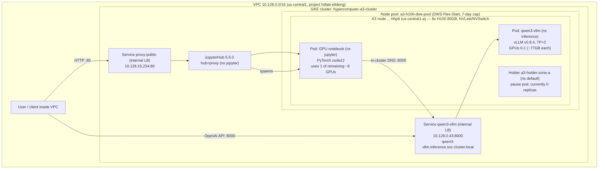

# AI Infrastructure Runbook — GKE + DWS H100 → Qwen3-32B Inference → JupyterHub

**Audience:** Engineers who are comfortable with the command line and Kubernetes basics but are **new to GPUs and Google Cloud AI infrastructure**. Every GPU/GCP term is defined in the glossary (Section 1) before it is used, and each concept is explained rather than assumed.

**What this runbook covers:** the full stack we stood up, end to end — a Google Kubernetes Engine (GKE) cluster, a GPU node pool that provisions an 8× H100 machine through Dynamic Workload Scheduler (DWS), a vLLM inference service that serves the Qwen3-32B model over an OpenAI-compatible API, and a JupyterHub host whose GPU notebooks land on the same H100 machine and call that inference endpoint.

**Live deployment this runbook documents:**

| Attribute | Value |
|---|---|
| Project | `hdlab-elideng` |
| Region | `us-central1` |
| Cluster | `hypercomputer-a3-cluster` |
| GPU node | `gke-hypercomputer-a3-a3-h100-dws-pool-16664d9c-hhp6` (zone `us-central1-a`) |
| Machine / GPUs | `a3-highgpu-8g` = 8× NVIDIA H100 80GB |
| Provisioning | DWS Flex-Start, 7-day cap (expires ~2026-07-23) |
| Inference | vLLM `v0.8.4` serving `qwen3-32b`, internal LB `10.128.0.43:8000` |
| Notebooks | JupyterHub 5.5.0, internal LB `10.128.15.234` |
| Date documented | 2026-07-17 |

---

## Section 1 — Introduction and Glossary

### 1.1 The 60-second mental model

Think of the stack as five nested layers, each one built on the one below it:

1. **A cluster** (GKE) — the managed Kubernetes control plane that schedules everything.
2. **A node pool** — a group of identical machines the cluster can add or remove. Ours is a GPU pool.
3. **A GPU machine** (the A3 node) — one physical server with 8 NVIDIA H100 GPUs, obtained through DWS.
4. **Pods** — the containers that actually run. Two consume GPUs: the vLLM inference server and (optionally) Jupyter notebooks.
5. **The services people use** — an OpenAI-compatible chat API (Qwen3-32B) and a JupyterHub web UI, each reachable inside the private network through a load balancer.

The rest of this document explains each layer with the real values from our deployment.

### 1.2 Glossary (read this first)

**GPU (Graphics Processing Unit)** — a processor with thousands of small cores optimized for the massively parallel math (matrix multiplies) that neural networks need. A modern LLM runs on GPUs, not CPUs, because a CPU would be orders of magnitude too slow.

**CUDA** — NVIDIA's software platform and driver stack that lets programs use the GPU. Software is compiled against a **CUDA version**; the version supported by the installed GPU **driver** must be new enough for the software. This version mismatch is a real gotcha in this deployment (see Section 3.4).

**DCGM (Data Center GPU Manager)** — NVIDIA's tool for monitoring GPU health, clocks, memory errors, and telemetry. Used in validation tests to confirm GPUs are healthy before handing them to workloads.

**H100** — NVIDIA's Hopper-generation data-center GPU. Our variant is the **H100 80GB HBM3** (81,559 MiB of high-bandwidth memory each). Big models like Qwen3-32B need this much memory.

**HBM (High-Bandwidth Memory)** — the fast memory physically stacked on the GPU. "80GB" refers to HBM capacity; model weights and activations live here.

**NVLink / NVSwitch** — NVIDIA's high-speed GPU-to-GPU interconnect. Inside one 8-GPU machine, **NVLink** connects GPUs directly and **NVSwitch** is the crossbar that lets all 8 talk at full bandwidth. This is what makes splitting a model across GPUs on the *same* machine fast (see tensor parallelism).

**NCCL (NVIDIA Collective Communications Library)** — a library for multi-GPU / multi-node communication. An "all-reduce" test verifies GPUs can exchange data over NVLink/RDMA without errors.

**A3 / `a3-highgpu-8g`** — Google Cloud's "A3 High" machine type: one VM with **8× H100 80GB** GPUs wired together with NVLink/NVSwitch. This is the single GPU machine at the center of this runbook.

**GKE (Google Kubernetes Engine)** — Google's managed Kubernetes. Google runs the control plane; you declare what you want (pods, services) and GKE schedules it onto nodes.

**Node** — one machine (VM) that belongs to the cluster and runs pods. Our GPU node is one `a3-highgpu-8g` VM.

**Node pool** — a set of nodes with identical configuration that GKE manages as a unit (can autoscale up/down). Ours is `a3-h100-dws-pool`.

**Pod** — the smallest deployable unit in Kubernetes: one or more containers scheduled together on a node. The vLLM server is a pod; each Jupyter notebook is a pod.

**Namespace** — a logical partition of the cluster for organizing and isolating workloads. We use `inference` (vLLM), `jupyter` (JupyterHub), and `default` (the capacity holder).

**Deployment** — a Kubernetes object that keeps a specified number of identical pod replicas running and handles rollouts/rollbacks.

**Service / LoadBalancer** — a stable network endpoint in front of pods. A **LoadBalancer** Service gets an IP address; with the `Internal` annotation on GCP it is a **private** IP reachable only inside the VPC (not the public internet). Both our services use internal load balancers.

**VPC (Virtual Private Cloud)** — the private network your cloud resources live in. Internal load balancer IPs (`10.128.x.x` here) are only reachable from inside this VPC.

**PVC (PersistentVolumeClaim) / PV / Persistent Disk** — a request for durable storage that outlives a pod. A PVC binds to a PersistentVolume backed by a GCP Persistent Disk. We use one to cache the downloaded model weights so restarts don't re-download 60+ GB.

**DWS (Dynamic Workload Scheduler) — Flex-Start mode** — a Google Cloud way to obtain scarce GPU capacity: you submit a request and GKE provisions the GPU node **when capacity becomes available**, then holds it for up to a **hard 7-day maximum run duration**. It is cheaper and easier to get than an on-demand or reserved GPU, at the cost of the 7-day cap and the wait for capacity. See Section 2.3.

**ProvisioningRequest** — the Kubernetes object DWS uses to ask for capacity. A pod must actively **consume** it (via specific annotations) to occupy the node once it arrives, or the node is reclaimed (see the reclaim-bug story, Section 2.4).

**Capacity holder ("holder")** — a tiny placeholder pod (a `pause` container) that occupies the GPU node so GKE does not scale it away when no real workload is running. House rule: never leave the DWS GPU node idle/unheld — re-arm a holder immediately after teardown.

**Taint / Toleration** — a taint marks a node so ordinary pods avoid it; a pod with a matching **toleration** is allowed to schedule there. GPU/DWS nodes are tainted so only GPU-aware pods land on them.

**nodeSelector** — a pod's rule to pick nodes by label (e.g. `cloud.google.com/gke-accelerator: nvidia-h100-80gb` targets the H100 node).

**Tensor parallelism (TP)** — a way to run a model too big or too slow for one GPU by **splitting each layer's weight matrices across multiple GPUs**, which then compute in lockstep and exchange partial results over NVLink. We use `--tensor-parallel-size 2`, so Qwen3-32B is split across 2 of the 8 H100s.

**vLLM** — a high-throughput open-source LLM inference server. It loads a model and exposes an **OpenAI-compatible** HTTP API (`/v1/models`, `/v1/chat/completions`), so existing OpenAI client code works by just changing the base URL.

**Qwen3-32B** — the ~32-billion-parameter open-weights LLM we serve. Ungated on Hugging Face (no access token required).

**OpenAI-compatible API** — an HTTP API that mimics OpenAI's endpoints and JSON schema, letting the official `openai` Python client (or `curl`) talk to a self-hosted model.

**JupyterHub** — multi-user Jupyter: a hub that authenticates users and spawns a private notebook server pod per user. Ours offers a CPU profile and a GPU profile that lands on the H100 node.

**Helm / chart / values.yaml** — Helm is Kubernetes' package manager; a **chart** is a packaged app (we use Zero-to-JupyterHub) and **`values.yaml`** is the config you supply to customize it.

**PDB (PodDisruptionBudget)** — a rule that limits how many replicas of a workload can be voluntarily evicted at once, protecting availability during node drains/rotations.

---

## Section 2 — Infrastructure (cluster → node pool → A3/H100 → DWS → networking)

### 2.1 The cluster

Everything runs on one regional GKE cluster:

- **Name:** `hypercomputer-a3-cluster`
- **Region:** `us-central1`
- **Project:** `hdlab-elideng`

The broader Infrastructure-as-Code foundation for this environment lives in `lab/` (the "SP-0 foundation"). It defines a regional GKE cluster with a **matrix of GPU node pools** (L4, A100, H100, H200, B200), each DWS flex-start autoscaled `0→N` and defaulting to **zero** nodes for cost control, with GPU networking (gVNIC, GPUDirect-TCPX/TCPXO, RDMA/CX-7) baked in per GPU type. It also wires in **Kueue** for per-team quota/admission and per-GPU-type smoke tests (DCGM + NCCL all-reduce). See `lab/README.md`. This runbook focuses on the **H100 pool** that we actually brought up.

Get credentials to talk to the cluster:

```bash
gcloud container clusters get-credentials hypercomputer-a3-cluster \
  --region us-central1 --project hdlab-elideng
```

### 2.2 The GPU node pool and the A3/H100 node

The GPU node pool is `a3-h100-dws-pool`. When capacity is granted, it provisions a single **`a3-highgpu-8g`** node:

- **Node name:** `gke-hypercomputer-a3-a3-h100-dws-pool-16664d9c-hhp6`
- **Zone:** `us-central1-a`
- **GPUs:** 8× NVIDIA H100 80GB HBM3 (each ~81,559 MiB), NVLink/NVSwitch-connected
- **Accelerator label:** `cloud.google.com/gke-accelerator=nvidia-h100-80gb` — pods select the node with this label.

Because it is a GPU/DWS node it carries taints; workloads must tolerate both:

```yaml
tolerations:
- { key: "nvidia.com/gpu",              operator: "Exists", effect: "NoSchedule" }
- { key: "cloud.google.com/gke-queued", operator: "Exists", effect: "NoSchedule" }
```

The `nvidia.com/gpu` taint keeps non-GPU pods off; `cloud.google.com/gke-queued` is the DWS/queued-provisioning taint.

### 2.3 Why DWS Flex-Start (and the 7-day cap)

H100 capacity is scarce and expensive. **DWS Flex-Start** lets us request an A3 node and have GKE provision it **when capacity frees up**, rather than paying to reserve it 24/7. The trade-offs:

- You may **wait** for capacity (hours, occasionally longer).
- Once provisioned, the node has a **hard 7-day `maxRunDuration`.** No holder or trick keeps a Flex-Start node past 7 days. Ours provisioned around 2026-07-16 and **expires ~2026-07-23**.
- It is not idle-scaled *away* during those 7 days **as long as a pod occupies it** — which is why we run a capacity holder when no real workload is bound.

For capacity that must live longer than 7 days (e.g. a multi-month lab), you need a **Compute Engine reservation** consumed by a **standard** (non-DWS) node pool — see Section 5.4 and `lab/RESERVATIONS.md`. You **cannot** convert a Flex-Start node to reserved; you stand up the reserved pool separately and migrate before expiry.

### 2.4 The reclaim bug story (bugfixes 0001 & 0002)

Getting a DWS H100 node to actually **stay** took two fixes. Both are worth understanding because they are easy traps.

**Bug 0001 — "multi-zone" requests weren't zone-scoped** (`bugfixes/0001-dws-zone-requests-not-zone-pinned.md`).
We had three per-zone ProvisioningRequests (`us-central1-a/b/c`) meant to hunt for capacity in parallel, but they differed **only by a cosmetic pod label** (`dws-zone: ...`) — their `nodeSelector` was identical and had **no `topology.kubernetes.io/zone`**. A label is metadata; it does not constrain scheduling. So all three requests were interchangeable and GKE never spread them. The fix added a real zone selector:

```yaml
nodeSelector:
  node.kubernetes.io/instance-type: a3-highgpu-8g
  gpu-cluster: a3-h100
  topology.kubernetes.io/zone: us-central1-a   # b / c in the others
```

**Lesson:** *labels ≠ scheduling constraints.* Also note each per-zone request asks for its **own** node — three requests can provision **3× a3-highgpu-8g (24 H100s)**, so decide up front whether you want one node or one-per-zone and cancel extras.

**Bug 0002 — the provisioned node was reclaimed ~10-15 minutes after boot** (`bugfixes/0002-dws-a3-node-reclaimed-after-10min.md`).
This is the painful one. The A3 node finally booted, joined the cluster… and ~15 minutes later GKE **deleted it**, back to zero. Root cause: **nothing in the cluster consumed the ProvisioningRequest.** DWS holds a freshly provisioned node for only a short (~10-minute) booking window; a pod must land on it inside that window or the autoscaler removes it as "not needed."

A pod only counts as consuming the request if it carries **both** annotations — and the prefix must be `autoscaling.x-k8s.io/`, *not* the older `cluster-autoscaler.kubernetes.io/`:

```yaml
autoscaling.x-k8s.io/consume-provisioning-request: <request-name>
autoscaling.x-k8s.io/provisioning-class-name: "queued-provisioning.gke.io"
```

The old holders had only `safe-to-evict: false` — which does nothing for a pod that was never scheduled. The fix (`configs/a3_dws_consumer_holders.yaml`) deploys a **zone-pinned consumer holder per request**, carrying both annotations plus `safe-to-evict: false`, requesting the full 8-GPU shape (`registry.k8s.io/pause:3.9`). Deployed **in parallel** with the request, it is already `Pending`-and-linked, so the scheduler binds it the instant the node provisions — inside the booking window — and the node stays up for the 7-day window.

Two mechanisms, both required:
1. **consume annotation** → pod placed on the node within the booking window (defeats the initial reclaim).
2. **occupying pod + `safe-to-evict: false`** → node stays up (defeats later idle scale-down).

Healthy signal after the fix (autoscaler event):
```
IgnoredInScaleUp — Unschedulable pod ignored in scale-up loop, because it's
consuming ProvisioningRequest default/a3-h100-req-zone-a that is in Accepted state.
```
The broken state instead logged `no.scale.up.nap.pod.gpu.no.limit.defined`.

### 2.5 Networking

- The cluster lives in a **VPC** using the `10.128.x.x` range.
- Both user-facing services are **internal LoadBalancers** (private IPs, reachable only inside the VPC), via the annotation `networking.gke.io/load-balancer-type: "Internal"`:
  - vLLM: `10.128.0.43:8000`
  - JupyterHub: `10.128.15.234:80`
- In-cluster, pods reach vLLM by DNS: `qwen3-vllm.inference.svc.cluster.local:8000` (the `<service>.<namespace>.svc.cluster.local` pattern). This is how Jupyter notebooks call the model without needing the IP.

---

## Section 3 — Inference service (vLLM serving Qwen3-32B)

### 3.1 What runs

A single vLLM pod in the `inference` namespace serves **Qwen3-32B** with an OpenAI-compatible API:

- **Image:** `vllm/vllm-openai:v0.8.4`
- **Served model name:** `qwen3-32b` (weights `Qwen/Qwen3-32B`, ungated)
- **`--tensor-parallel-size 2`** — the model is split across **2 of the 8 H100s**, using ~77 GB per GPU.
- **`--max-model-len 32768`**, `--gpu-memory-utilization 0.90`
- **Endpoint:** internal LB `10.128.0.43:8000`; in-cluster DNS `qwen3-vllm.inference.svc.cluster.local:8000`

### 3.2 The manifests

**Deployment** (`deploy/inference/vllm-deployment.yaml`):

```yaml
apiVersion: apps/v1
kind: Deployment
metadata: { name: qwen3-vllm, namespace: inference, labels: { app: qwen3-vllm } }
spec:
  replicas: 1
  selector: { matchLabels: { app: qwen3-vllm } }
  template:
    metadata: { labels: { app: qwen3-vllm } }
    spec:
      nodeSelector: { cloud.google.com/gke-accelerator: nvidia-h100-80gb }
      tolerations:
      - { key: "nvidia.com/gpu", operator: "Exists", effect: "NoSchedule" }
      - { key: "cloud.google.com/gke-queued", operator: "Exists", effect: "NoSchedule" }
      containers:
      - name: vllm
        image: vllm/vllm-openai:v0.8.4       # v0.8.4 - CUDA 12.0 compat + Qwen3 support
        args: ["--model","Qwen/Qwen3-32B","--served-model-name","qwen3-32b",
               "--tensor-parallel-size","2","--gpu-memory-utilization","0.90",
               "--max-model-len","32768","--host","0.0.0.0","--port","8000"]
        env:
        - { name: HF_HOME, value: /hf-cache }
        ports: [{ containerPort: 8000 }]
        resources:
          limits: { nvidia.com/gpu: "2", cpu: "24", memory: "200Gi" }
          requests: { nvidia.com/gpu: "2", cpu: "24", memory: "200Gi" }
        readinessProbe: { httpGet: { path: /health, port: 8000 }, initialDelaySeconds: 60, periodSeconds: 15, failureThreshold: 40 }
        livenessProbe: { httpGet: { path: /health, port: 8000 }, initialDelaySeconds: 600, periodSeconds: 30 }
        volumeMounts:
        - { name: hf-cache, mountPath: /hf-cache }
        - { name: shm, mountPath: /dev/shm }
      volumes:
      - { name: hf-cache, persistentVolumeClaim: { claimName: hf-cache } }
      - { name: shm, emptyDir: { medium: Memory, sizeLimit: 16Gi } }
```

Notes: the **`hf-cache` PVC** (150Gi `premium-rwo`, `deploy/inference/model-cache-pvc.yaml`) caches the downloaded weights so a pod restart does not re-download 60+ GB. The **`/dev/shm` 16Gi memory volume** is required — tensor parallelism uses shared memory for inter-GPU IPC, and the container default (64 MB) causes crashes.

**Internal LoadBalancer Service** (`deploy/inference/vllm-service-internal.yaml`):

```yaml
apiVersion: v1
kind: Service
metadata:
  name: qwen3-vllm
  namespace: inference
  annotations: { networking.gke.io/load-balancer-type: "Internal" }
spec:
  type: LoadBalancer
  selector: { app: qwen3-vllm }
  ports: [{ port: 8000, targetPort: 8000, protocol: TCP }]
```

**PodDisruptionBudget** (`deploy/inference/vllm-pdb.yaml`) — keeps ≥1 pod serving during node drains/rotations:

```yaml
apiVersion: policy/v1
kind: PodDisruptionBudget
metadata: { name: qwen3-vllm, namespace: inference }
spec: { minAvailable: 1, selector: { matchLabels: { app: qwen3-vllm } } }
```

### 3.3 Verified live output (from Task 1)

**Model list:**
```bash
curl localhost:8000/v1/models
```
```json
{"object":"list","data":[{"id":"qwen3-32b","object":"model","created":1784284247,
"owned_by":"vllm","root":"Qwen/Qwen3-32B","max_model_len":32768, ...}]}
```

**Chat completion:**
```bash
curl localhost:8000/v1/chat/completions -H 'Content-Type: application/json' \
  -d '{"model":"qwen3-32b","messages":[{"role":"user","content":"Reply with exactly: hello from qwen3"}],"max_tokens":20}'
```
```json
{"id":"chatcmpl-971f5573976c4b7ca0aecc292c892e86","object":"chat.completion",
 "model":"qwen3-32b",
 "choices":[{"index":0,"message":{"role":"assistant",
   "content":"<think>\nOkay, the user wants me to reply with exactly \"hello from qwen3\". Let"},
   "finish_reason":"length"}],
 "usage":{"prompt_tokens":17,"total_tokens":37,"completion_tokens":20}}
```
(Truncated at `max_tokens=20`. Qwen3 emits a `<think>…` reasoning preamble by default.)

**GPU utilization** (both TP GPUs loaded ~76 GB each):
```bash
kubectl -n inference exec deploy/qwen3-vllm -- nvidia-smi --query-gpu=index,memory.used --format=csv
```
```
index, memory.used [MiB]
0, 77583 MiB
1, 77583 MiB
```

### 3.4 The CUDA-version gotcha (why v0.8.4, not the newest vLLM)

The A3 node ships an NVIDIA driver whose **CUDA runtime is 12.0**. Newer vLLM images are built against **CUDA 12.2+** and fail to initialize on this driver. We pin **`vllm/vllm-openai:v0.8.4`** (CUDA 12.0-compatible and already supports Qwen3). This is not academic: a drift to `vllm/vllm-openai:v0.25.1` was observed **crash-looping** with "Engine core initialization failed"; re-applying the committed v0.8.4 manifest recovered the service (Task 1). **Always confirm the image's CUDA build against the node driver before upgrading vLLM.** (Note: `nvidia-smi` may report a higher "CUDA Version" — that is the driver's *max* supported CUDA, not what every image can safely assume; the working image must match what the runtime actually provides.)

### 3.5 How to call the endpoint

**curl (from inside the VPC / a pod):**
```bash
curl http://10.128.0.43:8000/v1/chat/completions \
  -H 'Content-Type: application/json' \
  -d '{"model":"qwen3-32b","messages":[{"role":"user","content":"Hello"}],"max_tokens":64}'
```

**Python (OpenAI client), using in-cluster DNS:**
```python
from openai import OpenAI
client = OpenAI(base_url="http://qwen3-vllm.inference.svc.cluster.local:8000/v1",
                api_key="none")   # vLLM ignores the key by default
resp = client.chat.completions.create(
    model="qwen3-32b",
    messages=[{"role": "user", "content": "Explain tensor parallelism in one sentence."}],
    max_tokens=128)
print(resp.choices[0].message.content)
```

---

## Section 4 — Jupyter host (JupyterHub with GPU notebooks)

### 4.1 What runs

**JupyterHub 5.5.0** (Zero-to-JupyterHub Helm chart `4.4.0`) in the `jupyter` namespace, exposed on internal LB **`10.128.15.234`** (port 80). It offers two notebook profiles:

- **CPU (no GPU)** — default; 4 CPU / 16 GB, no GPU.
- **GPU (1x H100)** — image `quay.io/jupyter/pytorch-notebook:cuda12-latest`, requests `nvidia.com/gpu: 1`, and carries the H100 `nodeSelector` + DWS tolerations so the notebook lands on the A3 node.

Each user gets a **20Gi `premium-rwo`** persistent home that survives server restarts.

### 4.2 Login and launch a GPU notebook

1. Browse to `http://10.128.15.234` (must be inside the VPC).
2. Log in with **any username** and password **`demo2026`** (DummyAuthenticator — demo only; replace with Google OAuth for production).
3. Select **"GPU (1x H100)"** from the profile dropdown → **Start My Server**.
4. First launch may take 2-3 minutes while the CUDA PyTorch image pulls; the pod schedules onto `gke-hypercomputer-a3-...-hhp6`.

### 4.3 The Helm values

`deploy/jupyter/values.yaml`:

```yaml
hub:
  config:
    JupyterHub:
      authenticator_class: dummy
    DummyAuthenticator:
      password: "demo2026"
proxy:
  service:
    type: LoadBalancer
    annotations:
      networking.gke.io/load-balancer-type: "Internal"
singleuser:
  storage:
    dynamic:
      storageClass: premium-rwo
    capacity: 20Gi
  profileList:
  - display_name: "CPU (no GPU)"
    default: true
    kubespawner_override:
      cpu_limit: 4
      mem_limit: "16G"
  - display_name: "GPU (1x H100)"
    kubespawner_override:
      image: quay.io/jupyter/pytorch-notebook:cuda12-latest
      extra_resource_limits:
        nvidia.com/gpu: "1"
      node_selector:
        cloud.google.com/gke-accelerator: nvidia-h100-80gb
      tolerations:
      - { key: "nvidia.com/gpu", operator: "Exists", effect: "NoSchedule" }
      - { key: "cloud.google.com/gke-queued", operator: "Exists", effect: "NoSchedule" }
```

### 4.4 Verified GPU access (from Task 2)

A GPU notebook (or the equivalent test pod) sees the H100:

```
Fri Jul 17 10:48:03 2026
+---------------------------------------------------------------------------------------+
| NVIDIA-SMI 535.309.01             Driver Version: 535.309.01   CUDA Version: 12.2     |
|   0  NVIDIA H100 80GB HBM3          Off | 00000000:04:00.0 Off |                    0 |
| N/A   33C    P0              71W / 700W |      0MiB / 81559MiB |      0%      Default |
+---------------------------------------------------------------------------------------+

CUDA available: True
Device: NVIDIA H100 80GB HBM3
```

The scheduling landed on the A3 node:
```
NAME                READY   STATUS    RESTARTS   AGE   NODE
gpu-schedule-test   1/1     Running   0          18s   gke-hypercomputer-a3-a3-h100-dws-pool-16664d9c-hhp6
```

### 4.5 Calling vLLM from a notebook (`call_vllm`)

The example notebook `deploy/jupyter/examples/call_vllm.ipynb` uses in-cluster DNS (works cross-namespace, `jupyter` → `inference`):

```python
from openai import OpenAI
client = OpenAI(base_url='http://qwen3-vllm.inference.svc.cluster.local:8000/v1', api_key='none')
response = client.chat.completions.create(
    model='qwen3-32b',
    messages=[{'role': 'user', 'content': '2+2?'}],
    max_tokens=20)
print(response.choices[0].message.content)
```

Verified live output:
```
vLLM response: <think>
Okay, so I need to figure out what 2 plus 2 is. Let me
```

The `gpu_check.ipynb` example runs `nvidia-smi` and `torch.cuda.is_available()` (output above). Both example notebooks live in `deploy/jupyter/examples/`.

---

## Section 5 — Operations

### 5.1 Cost and the capacity holder

The A3/H100 node is the expensive, scarce resource; the design keeps **exactly one workload on it at a time**, and never leaves it idle-but-unheld (house rule):

- When a real workload (vLLM) is running, **it** occupies the node.
- When there is no workload, the **holder** `a3-holder-zone-a` (ns `default`) is scaled to 1 to keep the node from being reclaimed.
- The holder is currently at **0 replicas** because vLLM holds the node. After any teardown, **re-arm the holder immediately** so the scarce node is never lost.

vLLM uses 2 of 8 GPUs; roughly **6 H100s remain** for GPU notebooks.

### 5.2 Deploy / handoff and teardown scripts

**Hand off the node from holder to vLLM** (`deploy/ops/handoff.sh`) — applies inference manifests then releases the holder, gap-free:
```bash
kubectl apply -f deploy/inference/          # PVC, deployment, service, pdb
kubectl -n default scale deploy/a3-holder-zone-a --replicas=0
```

**Tear down and re-arm the holder** (`deploy/ops/rearm-holder.sh`) — enforces the house rule:
```bash
kubectl -n inference delete deploy qwen3-vllm --ignore-not-found
kubectl -n default scale deploy/a3-holder-zone-a --replicas=1
```

### 5.3 Node rotation before 7-day expiry (zero-downtime)

DWS Flex-Start nodes expire at 7 days (~2026-07-23 for the current node). To rotate without downtime, use the **2-replica overlap** strategy (`deploy/ops/node-rotation-runbook.md`), protected by the PDB (`minAvailable: 1`):

1. **Days 5-6:** submit a new DWS request for a second A3 node in the same zone.
2. **When ready:** `kubectl -n inference scale deploy/qwen3-vllm --replicas=2` (each replica binds a separate node; PDB keeps ≥1 serving).
3. **Verify:** `kubectl -n inference get pods -l app=qwen3-vllm` (both healthy).
4. **Drain old node:** `kubectl cordon <old-node>` then `kubectl drain <old-node> --ignore-daemonsets --delete-emptydir-data` (PDB prevents both pods being evicted at once).
5. **Let the old node expire** and be reclaimed.
6. **Scale back:** `kubectl -n inference scale deploy/qwen3-vllm --replicas=1`.

Notes: PVCs reattach automatically in the same zone; a pending pod can trigger reprovisioning **if capacity is available** — if there is no A3 capacity, the overlap window is blocked, so plan the new request early.

### 5.4 Capacity / reservation reality (`lab/RESERVATIONS.md`)

The 7-day cap is a hard ceiling on Flex-Start — no holder defeats it. For durable GPUs (e.g. a 6-month lab):

- Use a **Compute Engine reservation** consumed by a **standard** node pool (`lab/blueprints/pools/h100-reserved.yaml`, `min=max=3`, COMPACT placement). Reserved nodes have **no run-duration cap**, are not idle-scaled, and give **guaranteed capacity** (no stockout wait).
- **Zone layout:** for a demo+debug lab, book all 3 A3 nodes in **one zone** with **COMPACT placement** rather than one-per-zone — the high-bandwidth A3 fabric (GPUDirect-TCPX/TCPXO/RDMA) **does not span zones**, so cross-zone falls back to slow TCP. Same-zone+COMPACT gives you both single-node experiments and a real 24-GPU multi-node fabric.
- **Cost:** a reservation bills at on-demand rate whether used or not, and persists until you delete it. CUDs are 1- or 3-year only (no 6-month discount).
- **Migration:** you cannot convert Flex-Start → reserved; stand up the reserved pool separately and move workloads/checkpoints **before** the 7-day expiry, then release the Flex-Start request.

```bash
gcloud compute reservations create a3-h100-res --project=hdlab-elideng \
  --zone=us-central1-a --require-specific-reservation --vm-count=3 \
  --machine-type=a3-highgpu-8g --accelerator=type=nvidia-h100-80gb,count=8
# then: cd lab && make up REGION=us-central1 ENABLED_POOLS=h100-reserved
```

### 5.5 Troubleshooting

| Symptom | Likely cause | Where to look |
|---|---|---|
| A3 node provisions then vanishes ~10-15 min later | Nothing consumed the ProvisioningRequest | `bugfixes/0002` — add the `autoscaling.x-k8s.io/*` consume annotations |
| DWS requests never spread across zones | `nodeSelector` missing `topology.kubernetes.io/zone` (label ≠ constraint) | `bugfixes/0001` |
| vLLM pod crash-loops "Engine core initialization failed" | vLLM image built for CUDA 12.2+ on a 12.0 driver | §3.4 — pin `v0.8.4`, re-apply committed manifest |
| vLLM OOM / IPC errors under TP | `/dev/shm` too small (64 MB default) | §3.2 — 16Gi memory `emptyDir` at `/dev/shm` |
| Notebook stuck `Pending` | GPU node full, or missing tolerations/nodeSelector | check holder/vLLM GPU usage; §4.3 |
| Model re-downloads on every restart | PVC cache not mounted / `HF_HOME` unset | §3.2 — `hf-cache` PVC + `HF_HOME=/hf-cache` |

Bug reports and the template live in `bugfixes/` (`bugfixes/README.md`).

---

## Section 6 — Appendices

### Appendix A — Command reference

```bash
# --- Cluster access ---
gcloud container clusters get-credentials hypercomputer-a3-cluster \
  --region us-central1 --project hdlab-elideng

# --- Inspect the GPU node ---
kubectl get nodes -L cloud.google.com/gke-accelerator
kubectl describe node gke-hypercomputer-a3-a3-h100-dws-pool-16664d9c-hhp6

# --- Inference (namespace: inference) ---
kubectl -n inference get deploy,po,svc,pvc,pdb
kubectl -n inference logs deploy/qwen3-vllm -f
kubectl -n inference exec deploy/qwen3-vllm -- nvidia-smi \
  --query-gpu=index,memory.used --format=csv
curl http://10.128.0.43:8000/v1/models
curl http://10.128.0.43:8000/v1/chat/completions -H 'Content-Type: application/json' \
  -d '{"model":"qwen3-32b","messages":[{"role":"user","content":"Hello"}],"max_tokens":64}'

# --- JupyterHub (namespace: jupyter) ---
kubectl -n jupyter get pods
kubectl -n jupyter get svc proxy-public          # -> internal IP 10.128.15.234
helm -n jupyter upgrade --install jhub jupyterhub/jupyterhub \
  --version 4.4.0 -f deploy/jupyter/values.yaml

# --- Ops: handoff / teardown / rotation ---
bash deploy/ops/handoff.sh                        # holder -> vLLM (gap-free)
bash deploy/ops/rearm-holder.sh                   # teardown + re-arm holder (house rule)
kubectl -n default get deploy a3-holder-zone-a    # holder state (0 = vLLM holds node)
kubectl -n inference scale deploy/qwen3-vllm --replicas=2   # rotation overlap
```

### Appendix B — Full manifests

The authoritative manifests are committed under `deploy/`:

- `deploy/inference/namespace.yaml` — creates `inference` and `jupyter` namespaces.
- `deploy/inference/model-cache-pvc.yaml` — 150Gi `premium-rwo` `hf-cache` PVC.
- `deploy/inference/vllm-deployment.yaml` — the vLLM Deployment (§3.2).
- `deploy/inference/vllm-service-internal.yaml` — internal LB Service (§3.2).
- `deploy/inference/vllm-pdb.yaml` — PodDisruptionBudget (§3.2).
- `deploy/jupyter/values.yaml` — JupyterHub Helm values (§4.3).
- `deploy/jupyter/examples/gpu_check.ipynb`, `deploy/jupyter/examples/call_vllm.ipynb` — example notebooks.
- `deploy/ops/handoff.sh`, `deploy/ops/rearm-holder.sh`, `deploy/ops/node-rotation-runbook.md` — operations.
- DWS/capacity: `configs/dws_provisioning_request_zone_{a,b,c}.yaml`, `configs/a3_dws_consumer_holders.yaml`.
- Foundation IaC: `lab/` (see `lab/README.md`, `lab/RESERVATIONS.md`).

The PVC, namespace, PDB and Service manifests are short and reproduced inline in §2/§3; the two larger ones (Deployment, JupyterHub values) are reproduced in full in §3.2 and §4.3.

### Appendix C — Architecture diagram



*(This Mermaid diagram renders in GitHub, VS Code, and mermaid.live. In the Google Docs HTML export, paste the rendered image separately — see the export note in the task report.)*

---

*End of runbook. All values reflect the live deployment as of 2026-07-17; the A3 Flex-Start node expires ~2026-07-23.*
