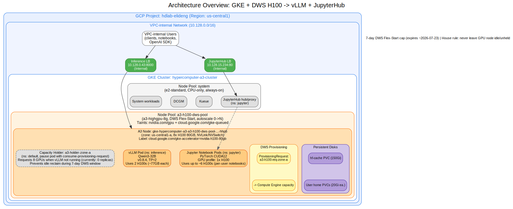
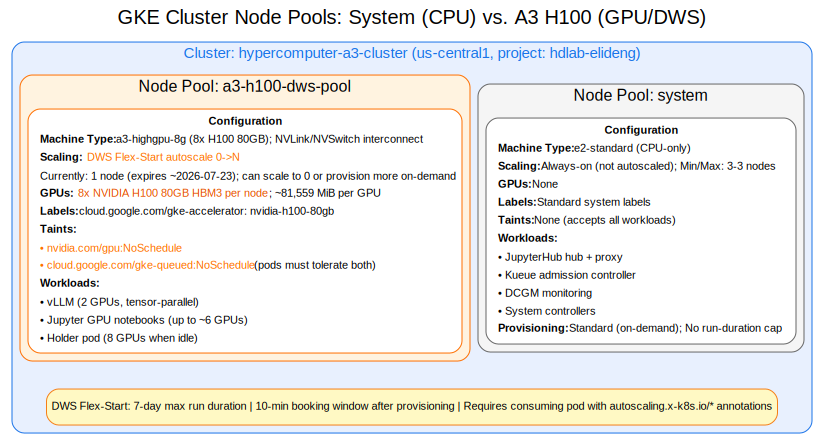
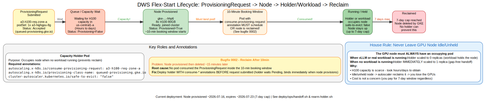
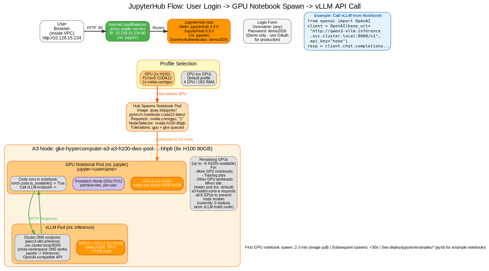

# Architecture Reference — GKE + H100 GPUs + Qwen3-32B Inference + JupyterHub

**Audience:** Engineers and technical staff who are **new to GPUs and Google Cloud AI infrastructure**. This guide explains the system top-down — from the high-level GKE architecture, down to how GPUs are obtained, and finally how the workloads run on them.

> **New to the terminology?** Every technical term (GPU, GKE, pod, DWS, tensor parallelism, …) is defined in plain language in the **[Glossary appendix](appendix-glossary.md)**. The guide links each term to its definition on first use, so you can jump there and back as needed.

**What this document covers:** The complete architecture of a system that provides:

1. A **[Qwen3-32B](appendix-glossary.md#qwen3-32b) inference endpoint** served by [vLLM](appendix-glossary.md#vllm) on NVIDIA [H100](appendix-glossary.md#h100) GPUs
2. A **[JupyterHub](appendix-glossary.md#jupyterhub)** environment where users can launch GPU-powered notebooks
3. All infrastructure running on [Google Kubernetes Engine (GKE)](appendix-glossary.md#gke) with [Dynamic Workload Scheduler (DWS)](appendix-glossary.md#dws-flex-start) provisioned GPUs

**How to read this guide:**

- **Sections 1–2** give the high-level architecture: what the system is and how the GKE stack is layered.
- **Section 3** explains how the scarce GPU node is obtained (DWS Flex-Start).
- **Sections 4–6** cover the two workloads (inference, notebooks) and how they share the GPUs.
- **Section 7** points to the step-by-step deployment and user guides.

---

## 1. Overview

This system is a **[GKE](appendix-glossary.md#gke) cluster** running on [Google Cloud Platform (GCP)](appendix-glossary.md#gcp), hosting two main services:

- **Inference endpoint:** A [vLLM](appendix-glossary.md#vllm) server that provides an [OpenAI-compatible API](appendix-glossary.md#openai-compatible-api) for the [Qwen3-32B](appendix-glossary.md#qwen3-32b) language model, using 2 NVIDIA [H100](appendix-glossary.md#h100) GPUs
- **JupyterHub:** A multi-user notebook environment where users can spawn CPU or GPU notebooks (using the remaining H100 GPUs on the same node)

Both services share a single 8-GPU [A3 machine](appendix-glossary.md#a3-machine) provisioned through **[DWS Flex-Start](appendix-glossary.md#dws-flex-start)** — a Google Cloud mechanism for obtaining scarce GPU capacity on demand, with a 7-day maximum runtime.



**Figure 1: Full system architecture.** The diagram shows the [VPC](appendix-glossary.md#vpc) network (internal-only, `10.128.x.x` range), the GKE cluster, the GPU node pool provisioned by DWS, the A3 node with 8 H100 GPUs, and how the inference and notebook services share the GPUs. Users access both services via internal load balancers from within the VPC.

### Live deployment values

| Attribute | Value |
|---|---|
| Project | `hdlab-elideng` |
| Region | `us-central1` |
| Cluster | `hypercomputer-a3-cluster` |
| GPU node | `gke-hypercomputer-a3-a3-h100-dws-pool-16664d9c-hhp6` (zone `us-central1-a`) |
| Machine / GPUs | `a3-highgpu-8g` = 8× NVIDIA H100 80GB |
| Provisioning | DWS Flex-Start, 7-day cap (expires ~2026-07-23) |
| Inference | vLLM `v0.8.4` serving `qwen3-32b`, internal LB `10.128.0.43:8000` |
| Notebooks | JupyterHub 5.5.0, internal LB `10.128.15.234` |

---

## 2. Layers of the Stack

The system is built in layers, each depending on the one below it. Reading top-down — from the GCP project, through the GKE cluster and its node pools, down to the individual GPUs — is the fastest way to build a mental model of how everything fits together.

### Layer 1: GCP Project and Region

- **Project:** `hdlab-elideng` — the [GCP](appendix-glossary.md#gcp) billing and resource container
- **Region:** `us-central1` (Iowa, USA)
- **VPC network:** A private network using the `10.128.0.0/16` IP range

All resources live in this project and region. The [VPC](appendix-glossary.md#vpc) provides private networking — internal load balancers get IPs like `10.128.0.43` that are only reachable from within this network.

### Layer 2: GKE Cluster

- **Cluster name:** `hypercomputer-a3-cluster`
- **Type:** Regional [GKE](appendix-glossary.md#gke) cluster (control plane spans multiple zones for high availability)
- **Management:** Google manages the control plane; we manage the workloads (pods, services, etc.)

Access the cluster with:

```bash
gcloud container clusters get-credentials hypercomputer-a3-cluster \
  --region us-central1 --project hdlab-elideng
kubectl get nodes
```

### Layer 3: Node Pools

A GKE cluster has one or more **[node pools](appendix-glossary.md#node-pool)** — groups of identical machines. Ours has:

1. **System node pool** — A few small CPU-only machines (`e2-standard-4` or similar) that run system components (Kubernetes daemons, networking, logging, monitoring). Always on, low cost.

2. **GPU node pool:** `a3-h100-dws-pool` — The single [A3 machine](appendix-glossary.md#a3-machine) with 8× H100 GPUs. Provisioned by [DWS Flex-Start](appendix-glossary.md#dws-flex-start). This is the **only GPU node** in the cluster.



**Figure 2: Node pool structure.** The cluster has a system pool (always-on CPU nodes) and a GPU pool (`a3-h100-dws-pool`) with one A3 node. The GPU node is provisioned on-demand by DWS and is the scarce, expensive resource.

### Layer 4: The A3 Node — 8× H100 GPUs with NVLink

- **Node name:** `gke-hypercomputer-a3-a3-h100-dws-pool-16664d9c-hhp6`
- **Machine type:** `a3-highgpu-8g`
- **Zone:** `us-central1-a`
- **GPUs:** 8× NVIDIA [H100](appendix-glossary.md#h100) 80GB HBM3 (each approximately 81,559 MiB)
- **GPU interconnect:** [NVLink + NVSwitch](appendix-glossary.md#nvlink-and-nvswitch) — all 8 GPUs can communicate with each other at high bandwidth
- **Accelerator label:** `cloud.google.com/gke-accelerator: nvidia-h100-80gb` (pods use this label to select the node)

**Node [taints](appendix-glossary.md#taint-and-toleration)** (to keep non-GPU pods away):

```yaml
nvidia.com/gpu: NoSchedule                # Only pods requesting GPUs
cloud.google.com/gke-queued: NoSchedule   # Only pods tolerating DWS
```

Workload pods must include matching **tolerations** to schedule on this node:

```yaml
tolerations:
- { key: "nvidia.com/gpu", operator: "Exists", effect: "NoSchedule" }
- { key: "cloud.google.com/gke-queued", operator: "Exists", effect: "NoSchedule" }
```

**Inside the A3 node:** The 8 H100 GPUs are numbered 0-7. Our vLLM service uses GPUs 0-1 ([tensor parallelism](appendix-glossary.md#tensor-parallelism) across 2 GPUs). The remaining approximately 6 GPUs are available for Jupyter notebooks and other GPU workloads.

### Layer 5: Pods and Services

**[Pods](appendix-glossary.md#pod)** are where applications actually run. Key pods in this system:

- **`qwen3-vllm` pod** (namespace `inference`) — Runs the vLLM inference server, using 2 H100 GPUs
- **JupyterHub hub and proxy pods** (namespace `jupyter`) — Run on the system node pool (no GPU)
- **User notebook pods** (namespace `jupyter`) — Spawned on demand; GPU notebooks land on the A3 node and request 1 GPU each
- **[Capacity holder](appendix-glossary.md#capacity-holder) pod** (namespace `default`) — A placeholder that keeps the A3 node from being reclaimed when no other workload is using it (currently scaled to 0 replicas because vLLM is running)

**[Services](appendix-glossary.md#service)** provide stable network endpoints:

- **`qwen3-vllm` Service** — [Internal LoadBalancer](appendix-glossary.md#loadbalancer-internal) at `10.128.0.43:8000` (and DNS name `qwen3-vllm.inference.svc.cluster.local:8000`)
- **`proxy-public` Service** — Internal LoadBalancer at `10.128.15.234:80` for JupyterHub

---

## 3. How GPUs are Obtained — DWS Flex-Start

### The DWS Flex-Start lifecycle

H100 GPUs are scarce and expensive. **[DWS Flex-Start](appendix-glossary.md#dws-flex-start)** is Google's mechanism for obtaining capacity on demand:

1. You submit a **[ProvisioningRequest](appendix-glossary.md#provisioningrequest)** asking for an A3 node
2. You **wait** for capacity to become available (hours, sometimes longer)
3. When capacity is found, GKE provisions the node — **but only holds it for about 10 minutes** (the "booking window")
4. A pod must be scheduled onto the node **within that window** and must have special annotations that "consume" the request, or GKE will reclaim the node
5. Once a consuming pod is running, the node stays up for the **7-day Flex-Start window** (hard cap — no extension possible)



**Figure 3: DWS Flex-Start lifecycle.** (1) Submit request → (2) Wait for capacity → (3) Node provisioned with ~10-minute booking window → (4) Consuming pod must land on node → (5) Node held for 7 days → (6) Expiry (must reprovision).

### The capacity holder pattern

Because the node is expensive and scarce, we **never leave it idle and unheld**. When no real workload (like vLLM) is running, we deploy a **[capacity holder](appendix-glossary.md#capacity-holder)** — a tiny `pause` pod that does nothing but occupy the node to prevent GKE from scaling it away.

**Current state:** The holder (`a3-holder-zone-a` in namespace `default`) is at **0 replicas** because the vLLM pod is holding the node. When vLLM is torn down, the holder must be re-armed (scaled to 1) immediately to keep the node.

### The reclaim bug and how it was fixed

Getting DWS to work reliably required fixing two critical bugs. These are documented in detail in [`bugfixes/0001-*`](../../bugfixes/0001-dws-zone-requests-not-zone-pinned.md) and [`bugfixes/0002-*`](../../bugfixes/0002-dws-a3-node-reclaimed-after-10min.md), summarized here because they teach important lessons:

**Bug 0001 — Zone pinning** ([`bugfixes/0001-dws-zone-requests-not-zone-pinned.md`](../../bugfixes/0001-dws-zone-requests-not-zone-pinned.md)):
We tried to request capacity in three zones (`us-central1-a/b/c`) in parallel by creating three ProvisioningRequests that differed only by a **label** (`dws-zone: us-central1-a`, etc.). But labels are just metadata — they don't constrain scheduling. Without `topology.kubernetes.io/zone` in the `nodeSelector`, all three requests were interchangeable, and GKE didn't actually spread them across zones.

**Lesson:** *Labels are not scheduling constraints.* To pin a pod to a zone, you need `topology.kubernetes.io/zone` in the [`nodeSelector`](appendix-glossary.md#nodeselector).

Also note that each per-zone request can provision its own node — submitting three requests can give you **3× a3-highgpu-8g = 24 H100s**. Decide up front whether you want one node total or one per zone, and cancel extras.

**Bug 0002 — The 10-minute reclaim** ([`bugfixes/0002-dws-a3-node-reclaimed-after-10min.md`](../../bugfixes/0002-dws-a3-node-reclaimed-after-10min.md)):
This was the critical one. The A3 node would finally provision after waiting hours… then GKE would **delete it 10-15 minutes later**, back to zero nodes. This happened because **nothing consumed the ProvisioningRequest**.

A pod only counts as consuming a request if it has both of these annotations (note the `autoscaling.x-k8s.io/` prefix, **not** the older `cluster-autoscaler.kubernetes.io/`):

```yaml
metadata:
  annotations:
    autoscaling.x-k8s.io/consume-provisioning-request: <request-name>
    autoscaling.x-k8s.io/provisioning-class-name: "queued-provisioning.gke.io"
```

Our early holder pods only had `safe-to-evict: false` (which is irrelevant for a pod that was never scheduled). The fix was to create **zone-pinned consumer holders** ([`configs/a3_dws_consumer_holders.yaml`](../../configs/a3_dws_consumer_holders.yaml)) — one per request — carrying both consume annotations plus `safe-to-evict: false`, requesting the full 8-GPU shape. Because the holder is deployed in parallel with the request, it's already `Pending` and linked when the node boots, so the scheduler binds it immediately (inside the 10-minute window), and the node stays up.

**Two mechanisms, both required:**

1. **Consume annotations** → pod placed on node within booking window (defeats initial reclaim)
2. **Occupying pod + `safe-to-evict: false`** → node stays up (defeats later idle scale-down)

**Healthy signal** (autoscaler event):

```
IgnoredInScaleUp — Unschedulable pod ignored in scale-up loop, because it's
consuming ProvisioningRequest default/a3-h100-req-zone-a that is in Accepted state.
```

The broken state instead logged `no.scale.up.nap.pod.gpu.no.limit.defined`.

### Going beyond 7 days: Reserved capacity

The 7-day cap is a **hard limit** of DWS Flex-Start — no holder or trick can extend it. For capacity that needs to live longer (e.g., a 6-month lab), use a **Compute Engine reservation** consumed by a **standard** (non-DWS) node pool. Reserved nodes have:

- **No run-duration cap** (persist until you delete them)
- **Guaranteed capacity** (no wait for availability)
- **No idle scale-down** (they stay up as long as the reservation exists)

For multi-node setups, **book all nodes in one zone with COMPACT placement** — the high-bandwidth GPU fabric (GPUDirect-TCPX/TCPXO/RDMA) doesn't span zones, so cross-zone nodes fall back to slow TCP.

**Full guide:** See [`lab/RESERVATIONS.md`](../../lab/RESERVATIONS.md) for step-by-step instructions and the reservation-backed `h100-reserved` pool blueprint.

**Cost:** Reservations bill at on-demand rate whether used or not. There are no 6-month commitments (CUDs are 1- or 3-year only), so a 6-month lab runs at on-demand pricing.

**Migration:** You cannot convert Flex-Start to reserved. Stand up the reserved pool separately and migrate workloads before the 7-day expiry.

---

## 4. Inference Architecture — vLLM Serving Qwen3-32B

### What the inference service does

The inference service is a **[vLLM](appendix-glossary.md#vllm)** server running in a pod in the `inference` namespace. It:

- Loads the **[Qwen3-32B](appendix-glossary.md#qwen3-32b)** model weights from Hugging Face
- Splits the model across **2 H100 GPUs** using [tensor parallelism](appendix-glossary.md#tensor-parallelism) (`--tensor-parallel-size 2`)
- Exposes an **[OpenAI-compatible HTTP API](appendix-glossary.md#openai-compatible-api)** on port 8000
- Is reachable at internal load balancer IP `10.128.0.43:8000` or in-cluster DNS name `qwen3-vllm.inference.svc.cluster.local:8000`


**Figure 4: Inference request flow.** A user sends an HTTP request (curl or Python OpenAI client) to the internal load balancer (`10.128.0.43:8000`). The request routes to the vLLM pod running on the A3 node. The pod spans GPUs 0-1 (tensor parallelism), processes the request, and returns the generated text.

### Technical details

- **Image:** `vllm/vllm-openai:v0.8.4`
- **Model:** `Qwen/Qwen3-32B` (from Hugging Face, ungated — no token needed)
- **Served model name:** `qwen3-32b` (the name you use in API calls)
- **Tensor parallelism:** `--tensor-parallel-size 2` (model split across 2 GPUs)
- **GPU memory used:** Approximately 77 GB (77583 MiB) per GPU
- **Context length:** `--max-model-len 32768` tokens
- **GPU memory utilization:** `--gpu-memory-utilization 0.90` (90% of available memory)
- **Endpoints:**
  - Health check: `GET /health`
  - List models: `GET /v1/models`
  - Chat completions: `POST /v1/chat/completions` (OpenAI-compatible)

### The CUDA version constraint (why vLLM v0.8.4)

The A3 node ships with an NVIDIA driver whose [CUDA](appendix-glossary.md#cuda) runtime is **12.0**. Newer vLLM images are built against CUDA 12.2+ and **will crash** on this driver with "Engine core initialization failed."

We pin **`vllm/vllm-openai:v0.8.4`**, which is CUDA 12.0-compatible and already supports Qwen3.

**Critical lesson:** Always verify the vLLM image's CUDA version against the node's driver before upgrading. A drift to a newer vLLM version was observed crash-looping; rolling back to v0.8.4 (the committed version) immediately recovered the service.

Note: `nvidia-smi` may report a higher "CUDA Version" (like 12.2) — that's the driver's *maximum* supported CUDA, not what every container image can safely assume. The image must be built for the actual runtime CUDA version.

### The manifests

The inference service is deployed via the manifests in [`deploy/inference/`](../../deploy/inference):

1. **`namespace.yaml`** — Creates the `inference` and `jupyter` namespaces
2. **`model-cache-pvc.yaml`** — 150Gi `premium-rwo` [PersistentVolumeClaim](appendix-glossary.md#pvc-and-persistent-disk) named `hf-cache` to cache model weights (avoids re-downloading 60+ GB on every restart)
3. **`vllm-deployment.yaml`** — The Deployment with 1 replica
4. **`vllm-service-internal.yaml`** — The internal LoadBalancer Service
5. **`vllm-pdb.yaml`** — [PodDisruptionBudget](appendix-glossary.md#pdb) requiring at least 1 pod available

**Key excerpts from the Deployment** (`deploy/inference/vllm-deployment.yaml`):

```yaml
nodeSelector:
  cloud.google.com/gke-accelerator: nvidia-h100-80gb   # Target the H100 node

tolerations:   # Allow scheduling on GPU/DWS node
- { key: "nvidia.com/gpu", operator: "Exists", effect: "NoSchedule" }
- { key: "cloud.google.com/gke-queued", operator: "Exists", effect: "NoSchedule" }

containers:
- name: vllm
  image: vllm/vllm-openai:v0.8.4
  args: ["--model", "Qwen/Qwen3-32B", "--served-model-name", "qwen3-32b",
         "--tensor-parallel-size", "2", "--gpu-memory-utilization", "0.90",
         "--max-model-len", "32768", "--host", "0.0.0.0", "--port", "8000"]
  env:
  - { name: HF_HOME, value: /hf-cache }   # Use the cached model weights
  resources:
    limits: { nvidia.com/gpu: "2", cpu: "24", memory: "200Gi" }
  volumeMounts:
  - { name: hf-cache, mountPath: /hf-cache }
  - { name: shm, mountPath: /dev/shm }    # 16Gi shared memory for tensor parallelism

volumes:
- { name: hf-cache, persistentVolumeClaim: { claimName: hf-cache } }
- { name: shm, emptyDir: { medium: Memory, sizeLimit: 16Gi } }
```

**Critical volumes:**

- **`hf-cache` PVC** — Caches the downloaded model weights so restarts don't re-download 60+ GB
- **`/dev/shm` 16Gi** — Tensor parallelism uses shared memory for inter-GPU communication; the default (64 MB) causes crashes

### How to call the inference endpoint

For full API details (curl, Python, streaming, error handling), see the **[Inference Endpoint User Guide](03-inference-endpoint-user-guide.md)**. A minimal example:

**From a command line (inside the VPC):**

```bash
curl http://10.128.0.43:8000/v1/chat/completions \
  -H 'Content-Type: application/json' \
  -d '{"model":"qwen3-32b","messages":[{"role":"user","content":"Hello, how are you?"}],"max_tokens":64}'
```

**From Python (using the OpenAI client):**

```python
from openai import OpenAI

client = OpenAI(
    base_url="http://10.128.0.43:8000/v1",   # Or use DNS: qwen3-vllm.inference.svc.cluster.local:8000
    api_key="none"   # vLLM ignores the key by default
)

response = client.chat.completions.create(
    model="qwen3-32b",
    messages=[{"role": "user", "content": "Explain tensor parallelism in one sentence."}],
    max_tokens=128
)

print(response.choices[0].message.content)
```

**Note:** The endpoint is only reachable from inside the VPC (internal load balancer). To call it from your laptop, you need to be on the VPN or use a bastion host / Cloud Shell.

---

## 5. Notebook Architecture — JupyterHub with GPU and CPU Profiles

### What JupyterHub provides

**[JupyterHub](appendix-glossary.md#jupyterhub)** is a multi-user Jupyter notebook environment. It runs in the `jupyter` namespace and:

- Hosts a **hub** that authenticates users and manages notebook servers
- Spawns a **private notebook pod** for each user (isolated environments)
- Offers two **profiles** at spawn time:
  - **CPU (no GPU):** Default, 4 CPU / 16 GB memory, runs on system node pool
  - **GPU (1× H100):** PyTorch + CUDA, requests 1 H100 GPU, lands on the A3 node

Each user gets a **20Gi persistent home directory** (backed by a GCP Persistent Disk) that survives server restarts.



**Figure 5: Jupyter notebook spawn and model call flow.** (1) User logs into JupyterHub at `10.128.15.234`. (2) User selects "GPU (1x H100)" profile and clicks Start My Server. (3) Hub spawns a notebook pod on the A3 node with 1 GPU. (4) User opens the notebook, writes Python code, and makes an API call to `qwen3-vllm.inference.svc.cluster.local:8000` using the OpenAI client. (5) Request routes to the vLLM pod, which generates a response.

### How to log in and launch a GPU notebook

For the full walkthrough (profiles, SSH, GPU usage, tips, and troubleshooting), see the **[Jupyter Notebook User Guide](04-jupyter-notebook-user-guide.md)**. In brief:

1. Browse to `http://10.128.15.234` (must be inside the VPC)
2. Log in with **any username** and password **`demo2026`**
   (This uses DummyAuthenticator, a demo-only auth method — replace with Google OAuth or another real authenticator for production)
3. On the profile selection page, choose **"GPU (1x H100)"** from the dropdown
4. Click **Start My Server**
5. First launch may take 2-3 minutes while the PyTorch CUDA image pulls

Once the notebook loads, you can run `nvidia-smi` in a terminal or `import torch; torch.cuda.is_available()` in a notebook cell to verify GPU access.

### Calling the inference endpoint from a notebook

Since the notebook pod and the vLLM pod are both in the same cluster, the notebook can reach vLLM via in-cluster DNS:

```python
from openai import OpenAI

client = OpenAI(
    base_url="http://qwen3-vllm.inference.svc.cluster.local:8000/v1",
    api_key="none"
)

response = client.chat.completions.create(
    model="qwen3-32b",
    messages=[{"role": "user", "content": "What is 2+2?"}],
    max_tokens=20
)

print(response.choices[0].message.content)
```

**Note:** The DNS name `qwen3-vllm.inference.svc.cluster.local` resolves to the vLLM Service within the cluster. This works even though the notebook is in the `jupyter` namespace and vLLM is in `inference` — Kubernetes DNS resolves `<service>.<namespace>.svc.cluster.local` cluster-wide.

### The JupyterHub Helm values

JupyterHub is deployed via the **Zero-to-JupyterHub** [Helm](appendix-glossary.md#helm) chart (version 4.4.0, JupyterHub 5.5.0). Configuration is in `deploy/jupyter/values.yaml`:

```yaml
hub:
  config:
    JupyterHub:
      authenticator_class: dummy
    DummyAuthenticator:
      password: "demo2026"

proxy:
  service:
    type: LoadBalancer
    annotations:
      networking.gke.io/load-balancer-type: "Internal"   # Internal LB only

singleuser:
  storage:
    dynamic:
      storageClass: premium-rwo   # GCP SSD persistent disk
    capacity: 20Gi                # 20 GB per user
  profileList:
  - display_name: "CPU (no GPU)"
    default: true
    kubespawner_override:
      cpu_limit: 4
      mem_limit: "16G"
  - display_name: "GPU (1x H100)"
    kubespawner_override:
      image: quay.io/jupyter/pytorch-notebook:cuda12-latest
      extra_resource_limits:
        nvidia.com/gpu: "1"
      node_selector:
        cloud.google.com/gke-accelerator: nvidia-h100-80gb
      tolerations:
      - { key: "nvidia.com/gpu", operator: "Exists", effect: "NoSchedule" }
      - { key: "cloud.google.com/gke-queued", operator: "Exists", effect: "NoSchedule" }
```

**Key points:**

- **DummyAuthenticator** is for demos only — any username works, password is `demo2026`
- **Internal LoadBalancer** — service only reachable inside the VPC
- **GPU profile** — Uses `quay.io/jupyter/pytorch-notebook:cuda12-latest` (includes PyTorch, CUDA, and common data science libraries), requests 1 GPU, and has the node selector + tolerations to land on the A3 node

---

## 6. GPU Allocation on the A3 Node

The A3 node has **8 H100 GPUs** (numbered 0-7). Here's how they're allocated:

| GPUs | Usage | Details |
|------|-------|---------|
| 0-1 | **vLLM inference** | Tensor parallelism (`--tensor-parallel-size 2`), approximately 77 GB used per GPU |
| 2-7 | **Available for notebooks and other workloads** | Approximately 6 GPUs free for GPU notebooks (each notebook requests 1 GPU) |
| 0-7 | **Capacity holder** (when vLLM is down) | When no real workload is running, the holder requests all 8 GPUs to keep the node from being reclaimed |

**Current state:** vLLM is running (GPUs 0-1), so approximately 6 GPUs are available for notebooks. If you scale vLLM to 0 replicas, you **must** immediately scale the holder (`a3-holder-zone-a` in namespace `default`) to 1 replica to prevent the node from being reclaimed.

**Capacity planning:** Each GPU notebook requests 1 GPU. With vLLM using 2 GPUs, you can run up to 6 concurrent GPU notebooks on this node. If you need more, you'd need to provision additional A3 nodes (which would require separate DWS requests and likely exceed the 7-day Flex-Start window per node).

---

## 7. Where to Go Next

This architecture guide provides the foundation for understanding the system. To actually deploy, use, or troubleshoot it, see the companion guides:

**Deploy it from scratch** — the step-by-step series (do them in order):

1. **[Cluster Setup](02a-cluster-setup.md)** — Project setup, GPU quota, and the regional GKE cluster
2. **[GPU Node Pool & DWS](02b-gpu-nodepool-dws.md)** — The A3 node pool, DWS provisioning, namespaces, and storage
3. **[Deploy Inference](02c-deploy-inference.md)** — vLLM serving Qwen3-32B
4. **[Deploy JupyterHub](02d-deploy-jupyter.md)** — GPU-enabled notebooks
5. **[Verify & Teardown](02e-verify-teardown.md)** — End-to-end checks, node rotation, and cleanup

**Use it:**

- **[Inference Endpoint User Guide](03-inference-endpoint-user-guide.md)** — How to use the vLLM inference API (curl, Python, streaming, error handling)
- **[Jupyter Notebook User Guide](04-jupyter-notebook-user-guide.md)** — How to log into JupyterHub, launch GPU notebooks, call the inference endpoint, and troubleshoot common issues

**Reference:**

- **[Glossary appendix](appendix-glossary.md)** — Plain-language definitions of every term used in these guides
- **[Lab IaC Foundation](../../lab/README.md)** — The Infrastructure-as-Code setup for the broader GPU matrix (L4, A100, H100, H200, B200) and Kueue-based workload management
- **Bugfixes** ([`0001`](../../bugfixes/0001-dws-zone-requests-not-zone-pinned.md), [`0002`](../../bugfixes/0002-dws-a3-node-reclaimed-after-10min.md)) — Detailed bug reports on the DWS zone pinning and reclaim issues, and how they were fixed

---

**Document version:** 2026-07-20
**Live deployment expiry:** The DWS Flex-Start node expires approximately 2026-07-23 (7-day cap from provisioning on 2026-07-16).
