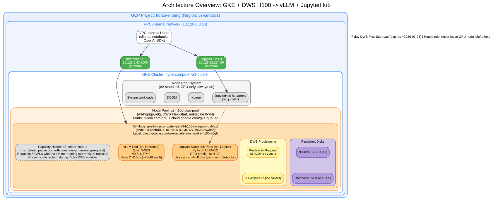
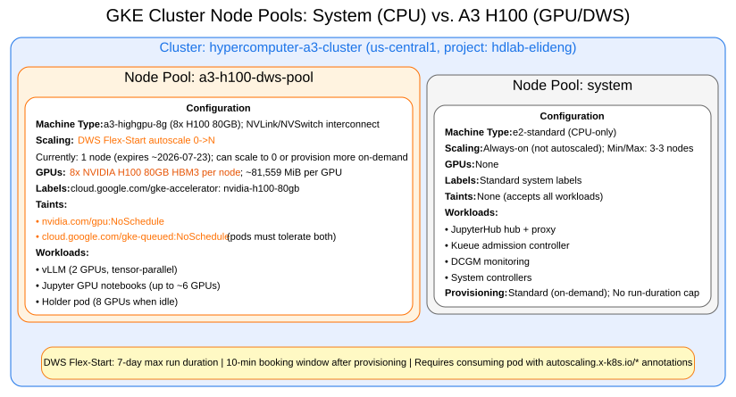
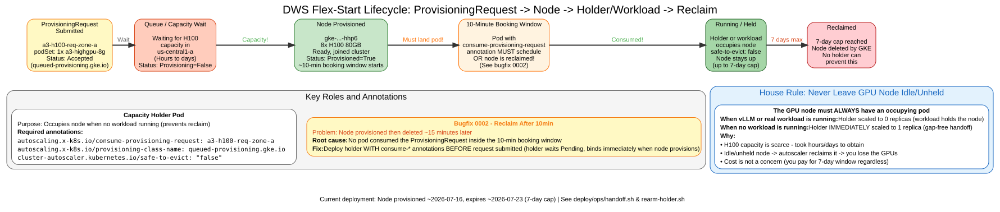
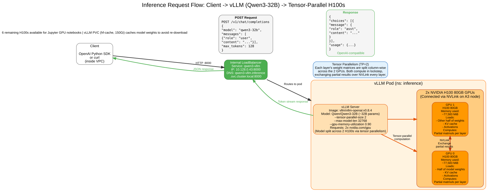
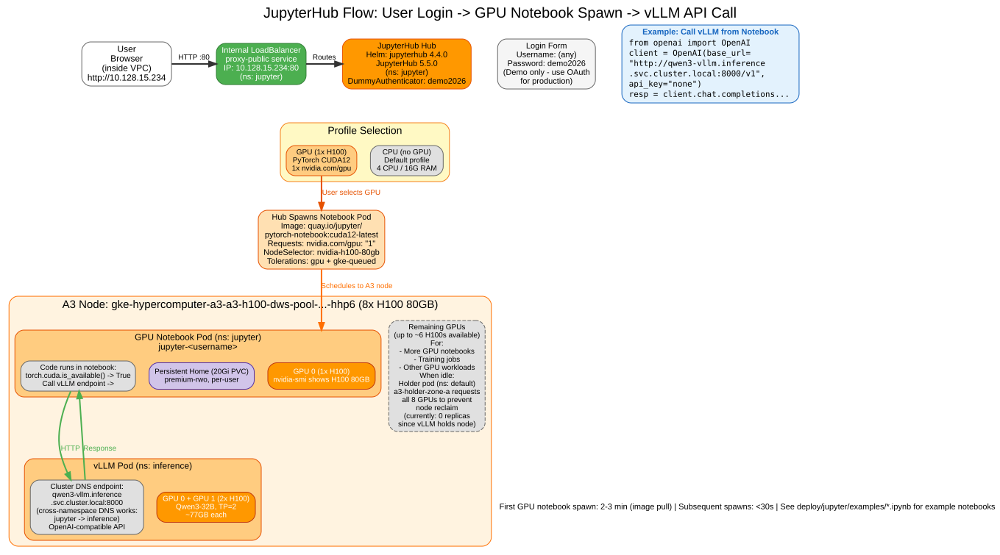

# Architecture Reference — GKE + H100 GPUs + Qwen3-32B Inference + JupyterHub

**Audience:** Engineers and technical staff who are **new to GPUs and Google Cloud AI infrastructure**. This guide explains the system top-down — from the high-level GKE architecture, down to how GPUs are obtained, and finally how the workloads run on them.

> **New to the terminology?** Every technical term (GPU, GKE, pod, DWS, tensor parallelism, …) is defined in plain language in the **[Glossary appendix](appendix-glossary.md)**. The guide links each term to its definition on first use, so you can jump there and back as needed.

**What this document covers:** The complete architecture of a system that provides:

1. A **[Qwen3-32B](appendix-glossary.md#qwen3-32b) inference endpoint** served by [vLLM](appendix-glossary.md#vllm) on NVIDIA [H100](appendix-glossary.md#h100) GPUs
2. A **[JupyterHub](appendix-glossary.md#jupyterhub)** environment where users can launch GPU-powered notebooks
3. All infrastructure running on [Google Kubernetes Engine (GKE)](appendix-glossary.md#gke) with [Dynamic Workload Scheduler (DWS)](appendix-glossary.md#dws-flex-start) provisioned GPUs
4. **Team access** to both services over public HTTPS — vLLM via an API key, JupyterHub via Google sign-in (see [Remote Access](05-remote-access-iap.md))

**How to read this guide:**

- **Sections 1–2** give the high-level architecture: what the system is and how the GKE stack is layered.
- **Section 3** explains how the scarce GPU node is obtained (DWS Flex-Start).
- **Sections 4–6** cover the two workloads (inference and notebooks), how each is reached — including the public HTTPS endpoints the team uses — and how they share the GPUs.
- **Section 7** points onward: the step-by-step deployment series, the user guides, and the remote-access setup.

---

## 1. Overview

This system is a **[GKE](appendix-glossary.md#gke) cluster** running on [Google Cloud Platform (GCP)](appendix-glossary.md#gcp), hosting two main services:

- **Inference endpoint:** A [vLLM](appendix-glossary.md#vllm) server that provides an [OpenAI-compatible API](appendix-glossary.md#openai-compatible-api) for the [Qwen3-32B](appendix-glossary.md#qwen3-32b) language model, using 2 NVIDIA [H100](appendix-glossary.md#h100) GPUs
- **JupyterHub:** A multi-user notebook environment where users can spawn CPU or GPU notebooks (using the remaining H100 GPUs on the same node)

Both services share a single 8-GPU [A3 machine](appendix-glossary.md#a3-machine) provisioned through **[DWS Flex-Start](appendix-glossary.md#dws-flex-start)** — a Google Cloud mechanism for obtaining scarce GPU capacity on demand, with a 7-day maximum runtime.



**Figure 1: Full system architecture.** The diagram shows the [VPC](appendix-glossary.md#vpc) network (internal-only, `10.128.x.x` range), the GKE cluster, the GPU node pool provisioned by DWS, the A3 node with 8 H100 GPUs, and how the inference and notebook services share the GPUs. Users access both services via internal load balancers from within the VPC.

### Live deployment values

> **Updated 2026-08-05 — the deployment moved region.** Everything now runs in
> **`asia-southeast1-c`** on **A3 Mega** nodes with the **GPUDirect-TCPXO** fabric armed.
> The original `us-central1` / `hypercomputer-a3-cluster` A3 High deployment described
> in the [from-scratch series](02a-cluster-setup.md) has been released. The two team URLs
> did **not** change, and neither did the vLLM API key — see
> [Remote Access](05-remote-access-iap.md).

| Attribute | Value |
|---|---|
| Project | `hdlab-elideng` |
| Region / zone | `asia-southeast1-c` (Singapore) |
| Cluster | `hypercomputer-a3-tcpxo` |
| GPU node pool | `a3-mega-tcpxo-flex-pool` — **3 nodes, 24× H100 Mega** |
| Machine / GPUs | `a3-megagpu-8g` = 8× NVIDIA H100 **Mega** 80GB per node |
| Accelerator label | `cloud.google.com/gke-accelerator: nvidia-h100-mega-80gb` |
| Inter-node fabric | **GPUDirect-TCPXO** — 8 dedicated GPU NICs per node (`eth1`–`eth8`), measured **317.84 GB/s** all-reduce busbw at 16 GPUs. See [§6](#6-the-tcpxo-fabric). |
| Provisioning | Flex-Start, 7-day cap, auto-re-grabbed by the [capacity watchdog](#capacity-watchdog) |
| Inference | vLLM `v0.8.4` serving `qwen3-32b` — public `https://infer.136.69.110.10.nip.io/v1` (API-key gated); in-cluster `qwen3-vllm.inference.svc.cluster.local:8000` |
| Notebooks | JupyterHub (z2jh 4.4.0) — public `https://jupyter.34.54.187.199.nip.io` (Google sign-in). See [Remote Access](05-remote-access-iap.md). |
| Admin SSH | Over **IAP TCP forwarding** — see [Remote Access → SSH](05-remote-access-iap.md#part-c--ssh-to-the-gpu-nodes-over-iap) |

---

## 2. Layers of the Stack

The system is built in layers, each depending on the one below it. Reading top-down — from the GCP project, through the GKE cluster and its node pools, down to the individual GPUs — is the fastest way to build a mental model of how everything fits together.

### Layer 1: GCP Project and Region

- **Project:** `hdlab-elideng` — the [GCP](appendix-glossary.md#gcp) billing and resource container
- **Zone:** `asia-southeast1-c` (Singapore)
- **VPC networks:** the `default` VPC carries ordinary pod/service traffic, **plus 8 additional
  VPCs** (`tcpxo-gpu-net-0` … `tcpxo-gpu-net-7`) that exist solely to carry GPU-to-GPU
  fabric traffic. A node has one NIC on each, so 9 NICs total. See [§6](#6-the-tcpxo-fabric).

All resources live in this project and region. The [VPC](appendix-glossary.md#vpc) provides private networking — internal resources use private `10.128.x.x` addresses reachable only within this network. The two user-facing services are additionally exposed to the team over public HTTPS (see [Remote Access](05-remote-access-iap.md)).

### Layer 2: GKE Cluster

- **Cluster name:** `hypercomputer-a3-tcpxo`
- **Type:** Zonal [GKE](appendix-glossary.md#gke) cluster in `asia-southeast1-c`
- **Management:** Google manages the control plane; we manage the workloads (pods, services, etc.)

> **Why zonal, not regional?** TCPXO's 8 additional node networks are zonal subnetworks,
> and all GPU nodes must sit in one zone for the fabric to be usable between them anyway.
> A regional control plane would add nothing here.

Access the cluster with:

```bash
gcloud container clusters get-credentials hypercomputer-a3-tcpxo \
  --location asia-southeast1-c --project hdlab-elideng
kubectl get nodes
```

### Layer 3: Node Pools

A GKE cluster has one or more **[node pools](appendix-glossary.md#node-pool)** — groups of identical machines. Ours has:

1. **`default-pool`** — A few small CPU-only machines that run system components (Kubernetes daemons, networking, logging, monitoring) and the JupyterHub hub/proxy. Always on, low cost.

2. **GPU node pool:** `a3-mega-tcpxo-flex-pool` — **3× [A3 Mega machines](appendix-glossary.md#a3-machine)**, 8 H100 Mega GPUs each = **24 GPUs**. Provisioned by [Flex-Start](appendix-glossary.md#dws-flex-start) and armed with the TCPXO fabric.



**Figure 2: Node pool structure.** *(Diagram predates the 2026-08-05 migration — it shows the single-node `us-central1` layout. The shape is the same; today the GPU pool is `a3-mega-tcpxo-flex-pool` with three A3 Mega nodes.)*

### Layer 4: The A3 Mega Nodes — 8× H100 Mega each, NVLink inside, TCPXO between

- **Node pool:** `a3-mega-tcpxo-flex-pool` (3 nodes; names look like `gke-hypercomputer-a3-a3-mega-tcpxo-fl-<hash>-<id>`)
- **Machine type:** `a3-megagpu-8g`
- **Zone:** `asia-southeast1-c`
- **GPUs:** 8× NVIDIA [H100](appendix-glossary.md#h100) **Mega** 80GB HBM3 per node, 24 total
- **GPU interconnect *within* a node:** [NVLink + NVSwitch](appendix-glossary.md#nvlink-and-nvswitch) — full bandwidth between all 8 local GPUs
- **GPU interconnect *between* nodes:** [GPUDirect-TCPXO](#6-the-tcpxo-fabric) over 8 dedicated NICs
- **Accelerator label:** `cloud.google.com/gke-accelerator: nvidia-h100-mega-80gb` (pods use this label to select a GPU node)

> ⚠️ **The label changed.** It is `nvidia-h100-mega-80gb`, not `nvidia-h100-80gb`. A pod
> carrying the old label matches no node and sits `Pending` forever with no obvious error.
> This is the single most common breakage when copying an older manifest.

**Node [taints](appendix-glossary.md#taint-and-toleration)** (to keep non-GPU pods away):

```yaml
nvidia.com/gpu: NoSchedule                # Only pods requesting GPUs
cloud.google.com/gke-queued: NoSchedule   # Only pods tolerating DWS
```

Workload pods must include matching **tolerations** to schedule on this node:

```yaml
tolerations:
- { key: "nvidia.com/gpu", operator: "Exists", effect: "NoSchedule" }
- { key: "cloud.google.com/gke-queued", operator: "Exists", effect: "NoSchedule" }
```

**How the 24 GPUs are allocated today:**

| Consumer | GPUs | Notes |
|---|---|---|
| `qwen3-vllm` (namespace `inference`) | 2 | [tensor parallelism](appendix-glossary.md#tensor-parallelism) across 2 GPUs on one node |
| `gpu-holder-tcpxo` (namespace `default`) | 8 + 8 | two full-node [capacity holders](appendix-glossary.md#capacity-holder) |
| `gpu-holder-tcpxo-partial` (namespace `default`) | 6 | shares vLLM's node — holds what vLLM does not use |
| **Total held** | **24 / 24** | |

**Why the pool is always 100% allocated:** Flex-Start capacity is reclaimed once nothing is
using it, and H100 Mega capacity in this zone is scarce enough that getting it back is not
guaranteed. So every GPU is deliberately held. To run a notebook or a training job you do
**not** wait for a free GPU — you *shrink a holder* to hand GPUs over. See
[`deploy/ops/rearm-holder.sh`](../../deploy/ops/rearm-holder.sh) and
[Part 5 → node rotation](02e-verify-teardown.md#step-10-node-rotation-and-the-7-day-expiry).

> ⚠️ **Never scale a holder to 0 replicas on a Flex pool.** An empty node is an idle node,
> and an idle Flex node can be reclaimed within minutes. Lower its GPU *request* instead
> (which needs `strategy: Recreate` on the Deployment), so the pod keeps occupying the node
> while giving up GPUs.

### Layer 5: Pods and Services

**[Pods](appendix-glossary.md#pod)** are where applications actually run. Key pods in this system:

- **`qwen3-vllm` pod** (namespace `inference`) — Runs the vLLM inference server on 2 H100 Mega GPUs, with a `tcpxo-daemon` sidecar so it shares the fabric stack with the training jobs
- **JupyterHub hub and proxy pods** (namespace `jupyter`) — Run on `default-pool` (no GPU)
- **User notebook pods** (namespace `jupyter`) — Spawned on demand; GPU profiles land on an A3 Mega node. The **8-GPU profile is TCPXO-armed** (see [Jupyter User Guide](04-jupyter-notebook-user-guide.md))
- **[Capacity holder](appendix-glossary.md#capacity-holder) pods** (namespace `default`) — `gpu-holder-tcpxo` (2 replicas × 8 GPUs) and `gpu-holder-tcpxo-partial` (6 GPUs). These are **not** idle waste: they are what stops the Flex nodes being reclaimed. They are always running, never scaled to 0

**[Services](appendix-glossary.md#service)** provide stable network endpoints:

- **`qwen3-vllm` Service** — in-cluster DNS `qwen3-vllm.inference.svc.cluster.local:8000`, and exposed to the team over public HTTPS at `https://infer.136.69.110.10.nip.io/v1` (API-key gated)
- **`proxy-public` Service** — JupyterHub, exposed over public HTTPS at `https://jupyter.34.54.187.199.nip.io` (Google sign-in)

> These two services were originally internal-only load balancers; they are now fronted by public HTTPS load balancers. See **[Remote Access](05-remote-access-iap.md)** for how (Ingress + managed TLS, GoogleOAuthenticator for JupyterHub, API key for vLLM).

---

## 3. How GPUs are Obtained — DWS Flex-Start

### The DWS Flex-Start lifecycle

H100 GPUs are scarce and expensive. **[DWS Flex-Start](appendix-glossary.md#dws-flex-start)** is Google's mechanism for obtaining capacity on demand:

1. You submit a **[ProvisioningRequest](appendix-glossary.md#provisioningrequest)** asking for an A3 node
2. You **wait** for capacity to become available (hours, sometimes longer)
3. When capacity is found, GKE provisions the node — **but only holds it for about 10 minutes** (the "booking window")
4. A pod must be scheduled onto the node **within that window** and must have special annotations that "consume" the request, or GKE will reclaim the node
5. Once a consuming pod is running, the node stays up for the **7-day Flex-Start window** (hard cap — no extension possible)



**Figure 3: DWS Flex-Start lifecycle.** (1) Submit request → (2) Wait for capacity → (3) Node provisioned with ~10-minute booking window → (4) Consuming pod must land on node → (5) Node held for 7 days → (6) Expiry (must reprovision).

### The capacity holder pattern

Because the node is expensive and scarce, we **never leave it idle and unheld**. When no real workload (like vLLM) is running, we deploy a **[capacity holder](appendix-glossary.md#capacity-holder)** — a tiny `pause` pod that does nothing but occupy the node to prevent GKE from scaling it away.

**Current state:** The holder (`a3-holder-zone-a` in namespace `default`) is at **0 replicas** because the vLLM pod is holding the node. When vLLM is torn down, the holder must be re-armed (scaled to 1) immediately to keep the node.

### The reclaim bug and how it was fixed

Getting DWS to work reliably required fixing two critical bugs. These are documented in detail in [`bugfixes/0001-*`](../../bugfixes/0001-dws-zone-requests-not-zone-pinned.md) and [`bugfixes/0002-*`](../../bugfixes/0002-dws-a3-node-reclaimed-after-10min.md), summarized here because they teach important lessons:

**Bug 0001 — Zone pinning** ([`bugfixes/0001-dws-zone-requests-not-zone-pinned.md`](../../bugfixes/0001-dws-zone-requests-not-zone-pinned.md)):
We tried to request capacity in three zones (`us-central1-a/b/c`) in parallel by creating three ProvisioningRequests that differed only by a **label** (`dws-zone: us-central1-a`, etc.). But labels are just metadata — they don't constrain scheduling. Without `topology.kubernetes.io/zone` in the `nodeSelector`, all three requests were interchangeable, and GKE didn't actually spread them across zones.

**Lesson:** *Labels are not scheduling constraints.* To pin a pod to a zone, you need `topology.kubernetes.io/zone` in the [`nodeSelector`](appendix-glossary.md#nodeselector).

Also note that each per-zone request can provision its own node — submitting three requests can give you **3× a3-highgpu-8g = 24 H100s**. Decide up front whether you want one node total or one per zone, and cancel extras.

**Bug 0002 — The 10-minute reclaim** ([`bugfixes/0002-dws-a3-node-reclaimed-after-10min.md`](../../bugfixes/0002-dws-a3-node-reclaimed-after-10min.md)):
This was the critical one. The A3 node would finally provision after waiting hours… then GKE would **delete it 10-15 minutes later**, back to zero nodes. This happened because **nothing consumed the ProvisioningRequest**.

A pod only counts as consuming a request if it has both of these annotations (note the `autoscaling.x-k8s.io/` prefix, **not** the older `cluster-autoscaler.kubernetes.io/`):

```yaml
metadata:
  annotations:
    autoscaling.x-k8s.io/consume-provisioning-request: <request-name>
    autoscaling.x-k8s.io/provisioning-class-name: "queued-provisioning.gke.io"
```

Our early holder pods only had `safe-to-evict: false` (which is irrelevant for a pod that was never scheduled). The fix was to create **zone-pinned consumer holders** ([`configs/a3_dws_consumer_holders.yaml`](../../configs/a3_dws_consumer_holders.yaml)) — one per request — carrying both consume annotations plus `safe-to-evict: false`, requesting the full 8-GPU shape. Because the holder is deployed in parallel with the request, it's already `Pending` and linked when the node boots, so the scheduler binds it immediately (inside the 10-minute window), and the node stays up.

**Two mechanisms, both required:**

1. **Consume annotations** → pod placed on node within booking window (defeats initial reclaim)
2. **Occupying pod + `safe-to-evict: false`** → node stays up (defeats later idle scale-down)

**Healthy signal** (autoscaler event):

```
IgnoredInScaleUp — Unschedulable pod ignored in scale-up loop, because it's
consuming ProvisioningRequest default/a3-h100-req-zone-a that is in Accepted state.
```

The broken state instead logged `no.scale.up.nap.pod.gpu.no.limit.defined`.

### Going beyond 7 days: Reserved capacity

The 7-day cap is a **hard limit** of DWS Flex-Start — no holder or trick can extend it. For capacity that needs to live longer (e.g., a 6-month lab), use a **Compute Engine reservation** consumed by a **standard** (non-DWS) node pool. Reserved nodes have:

- **No run-duration cap** (persist until you delete them)
- **Guaranteed capacity** (no wait for availability)
- **No idle scale-down** (they stay up as long as the reservation exists)

For multi-node setups, **book all nodes in one zone with COMPACT placement** — the high-bandwidth GPU fabric (GPUDirect-TCPX/TCPXO/RDMA) doesn't span zones, so cross-zone nodes fall back to slow TCP.

**Full guide:** See [`lab/RESERVATIONS.md`](../../lab/RESERVATIONS.md) for step-by-step instructions and the reservation-backed `h100-reserved` pool blueprint.

**Cost:** Reservations bill at on-demand rate whether used or not. There are no 6-month commitments (CUDs are 1- or 3-year only), so a 6-month lab runs at on-demand pricing.

**Migration:** You cannot convert Flex-Start to reserved. Stand up the reserved pool separately and migrate workloads before the 7-day expiry.

---

## 4. Inference Architecture — vLLM Serving Qwen3-32B

### What the inference service does

The inference service is a **[vLLM](appendix-glossary.md#vllm)** server running in a pod in the `inference` namespace. It:

- Loads the **[Qwen3-32B](appendix-glossary.md#qwen3-32b)** model weights from Hugging Face
- Splits the model across **2 H100 GPUs** using [tensor parallelism](appendix-glossary.md#tensor-parallelism) (`--tensor-parallel-size 2`)
- Exposes an **[OpenAI-compatible HTTP API](appendix-glossary.md#openai-compatible-api)** on port 8000
- Is reachable in-cluster at DNS name `qwen3-vllm.inference.svc.cluster.local:8000`, and to the team over public HTTPS at `https://infer.136.69.110.10.nip.io/v1` — all requests require the API key (`Authorization: Bearer <key>`). See [Remote Access](05-remote-access-iap.md).



**Figure 4: Inference request flow.** A user sends an HTTP request (curl or Python OpenAI client, with the API key) to the endpoint — the public HTTPS load balancer or the in-cluster DNS name. The request routes to the vLLM pod running on the A3 node. The pod spans GPUs 0-1 (tensor parallelism), processes the request, and returns the generated text.

### Technical details

- **Image:** `vllm/vllm-openai:v0.8.4`
- **Model:** `Qwen/Qwen3-32B` (from Hugging Face, ungated — no token needed)
- **Served model name:** `qwen3-32b` (the name you use in API calls)
- **Tensor parallelism:** `--tensor-parallel-size 2` (model split across 2 GPUs)
- **GPU memory used:** Approximately 77 GB (77583 MiB) per GPU
- **Context length:** `--max-model-len 32768` tokens
- **GPU memory utilization:** `--gpu-memory-utilization 0.90` (90% of available memory)
- **Endpoints:**
  - Health check: `GET /health`
  - List models: `GET /v1/models`
  - Chat completions: `POST /v1/chat/completions` (OpenAI-compatible)

### The CUDA version constraint (why vLLM v0.8.4)

The A3 node ships with an NVIDIA driver whose [CUDA](appendix-glossary.md#cuda) runtime is **12.0**. Newer vLLM images are built against CUDA 12.2+ and **will crash** on this driver with "Engine core initialization failed."

We pin **`vllm/vllm-openai:v0.8.4`**, which is CUDA 12.0-compatible and already supports Qwen3.

**Critical lesson:** Always verify the vLLM image's CUDA version against the node's driver before upgrading. A drift to a newer vLLM version was observed crash-looping; rolling back to v0.8.4 (the committed version) immediately recovered the service.

Note: `nvidia-smi` may report a higher "CUDA Version" (like 12.2) — that's the driver's *maximum* supported CUDA, not what every container image can safely assume. The image must be built for the actual runtime CUDA version.

### The manifests

The inference service is deployed via the manifests in [`deploy/inference/`](../../deploy/inference):

1. **`namespace.yaml`** — Creates the `inference` and `jupyter` namespaces
2. **`model-cache-pvc.yaml`** — 150Gi `premium-rwo` [PersistentVolumeClaim](appendix-glossary.md#pvc-and-persistent-disk) named `hf-cache` to cache model weights (avoids re-downloading 60+ GB on every restart)
3. **`vllm-deployment.yaml`** — The Deployment with 1 replica
4. **`vllm-service-internal.yaml`** — The internal LoadBalancer Service
5. **`vllm-pdb.yaml`** — [PodDisruptionBudget](appendix-glossary.md#pdb) requiring at least 1 pod available

**Key excerpts from the Deployment** (`deploy/inference/vllm-deployment.yaml`):

> **The live manifest is now [`deploy/tcpxo-migration/02-vllm-tcpxo.yaml`](../../deploy/tcpxo-migration/02-vllm-tcpxo.yaml)** — same vLLM version and arguments, but TCPXO-armed and
> pointed at the Mega accelerator label. The excerpt below is kept because it shows the
> general shape; copy the tcpxo-migration file if you are deploying.

```yaml
nodeSelector:
  cloud.google.com/gke-accelerator: nvidia-h100-mega-80gb   # A3 Mega (was nvidia-h100-80gb)

tolerations:   # Allow scheduling on GPU/DWS node
- { key: "nvidia.com/gpu", operator: "Exists", effect: "NoSchedule" }
- { key: "cloud.google.com/gke-queued", operator: "Exists", effect: "NoSchedule" }

containers:
- name: vllm
  image: vllm/vllm-openai:v0.8.4
  args: ["--model", "Qwen/Qwen3-32B", "--served-model-name", "qwen3-32b",
         "--tensor-parallel-size", "2", "--gpu-memory-utilization", "0.90",
         "--max-model-len", "32768", "--host", "0.0.0.0", "--port", "8000"]
  env:
  - { name: HF_HOME, value: /hf-cache }   # Use the cached model weights
  resources:
    limits: { nvidia.com/gpu: "2", cpu: "24", memory: "200Gi" }
  volumeMounts:
  - { name: hf-cache, mountPath: /hf-cache }
  - { name: shm, mountPath: /dev/shm }    # 16Gi shared memory for tensor parallelism

volumes:
- { name: hf-cache, persistentVolumeClaim: { claimName: hf-cache } }
- { name: shm, emptyDir: { medium: Memory, sizeLimit: 16Gi } }
```

**Critical volumes:**

- **`hf-cache` PVC** — Caches the downloaded model weights so restarts don't re-download 60+ GB
- **`/dev/shm` 16Gi** — Tensor parallelism uses shared memory for inter-GPU communication; the default (64 MB) causes crashes

### How to call the inference endpoint

For full API details (curl, Python, streaming, error handling), see the **[Inference Endpoint User Guide](03-inference-endpoint-user-guide.md)**. A minimal example:

**From a command line (inside the VPC):**

```bash
curl https://infer.136.69.110.10.nip.io/v1/chat/completions \
  -H "Authorization: Bearer $VLLM_API_KEY" \
  -H 'Content-Type: application/json' \
  -d '{"model":"qwen3-32b","messages":[{"role":"user","content":"Hello, how are you?"}],"max_tokens":64}'
```

**From Python (using the OpenAI client):**

```python
from openai import OpenAI

client = OpenAI(
    base_url="https://infer.136.69.110.10.nip.io/v1",   # public; or in-cluster DNS qwen3-vllm.inference.svc.cluster.local:8000
    api_key="<VLLM_API_KEY>"   # required — value is in the vllm-api-key secret
)

response = client.chat.completions.create(
    model="qwen3-32b",
    messages=[{"role": "user", "content": "Explain tensor parallelism in one sentence."}],
    max_tokens=128
)

print(response.choices[0].message.content)
```

**Note:** The endpoint is only reachable from inside the VPC (internal load balancer). To call it from your laptop, you need to be on the VPN or use a bastion host / Cloud Shell.

---

## 5. Notebook Architecture — JupyterHub with GPU and CPU Profiles

### What JupyterHub provides

**[JupyterHub](appendix-glossary.md#jupyterhub)** is a multi-user Jupyter notebook environment. It runs in the `jupyter` namespace and:

- Hosts a **hub** that authenticates users and manages notebook servers
- Spawns a **private notebook pod** for each user (isolated environments)
- Offers two **profiles** at spawn time:
  - **CPU (no GPU):** Default, 4 CPU / 16 GB memory, runs on system node pool
  - **GPU (1× H100):** PyTorch + CUDA, requests 1 H100 GPU, lands on the A3 node

Each user gets a **20Gi persistent home directory** (backed by a GCP Persistent Disk) that survives server restarts.



**Figure 5: Jupyter notebook spawn and model call flow.** (1) User opens JupyterHub at `https://jupyter.34.54.187.199.nip.io` and signs in with Google. (2) User selects "GPU (1x H100)" profile and clicks Start My Server. (3) Hub spawns a notebook pod on the A3 node with 1 GPU. (4) User opens the notebook, writes Python code, and makes an API call to `qwen3-vllm.inference.svc.cluster.local:8000` (with the API key) using the OpenAI client. (5) Request routes to the vLLM pod, which generates a response.

### How to log in and launch a GPU notebook

For the full walkthrough (profiles, GPU usage, tips, and troubleshooting), see the **[Jupyter Notebook User Guide](04-jupyter-notebook-user-guide.md)**. In brief:

1. Browse to `https://jupyter.34.54.187.199.nip.io`
2. **Sign in with Google** using your Workspace account (restricted to the org domain; no shared password). See [Remote Access](05-remote-access-iap.md) for the auth setup.
3. On the profile selection page, choose **"GPU (1x H100)"** from the dropdown
4. Click **Start My Server**
5. First launch may take 2-3 minutes while the PyTorch CUDA image pulls

Once the notebook loads, you can run `nvidia-smi` in a terminal or `import torch; torch.cuda.is_available()` in a notebook cell to verify GPU access.

### Calling the inference endpoint from a notebook

Since the notebook pod and the vLLM pod are both in the same cluster, the notebook can reach vLLM via in-cluster DNS:

```python
from openai import OpenAI

client = OpenAI(
    base_url="http://qwen3-vllm.inference.svc.cluster.local:8000/v1",
    api_key="<VLLM_API_KEY>"   # required — value is in the vllm-api-key secret
)

response = client.chat.completions.create(
    model="qwen3-32b",
    messages=[{"role": "user", "content": "What is 2+2?"}],
    max_tokens=20
)

print(response.choices[0].message.content)
```

**Note:** The DNS name `qwen3-vllm.inference.svc.cluster.local` resolves to the vLLM Service within the cluster. This works even though the notebook is in the `jupyter` namespace and vLLM is in `inference` — Kubernetes DNS resolves `<service>.<namespace>.svc.cluster.local` cluster-wide.

### The JupyterHub Helm values

JupyterHub is deployed via the **Zero-to-JupyterHub** [Helm](appendix-glossary.md#helm) chart (version 4.4.0, JupyterHub 5.5.0). The base configuration is in `deploy/jupyter/values.yaml` (shown below — internal LB, demo auth). The **live deployment layers a public-access overlay** on top (`deploy/expose/jupyter-values-public.yaml`): GoogleOAuthenticator + a ClusterIP proxy behind a public HTTPS Ingress. See **[Remote Access](05-remote-access-iap.md)**.

```yaml
hub:
  config:
    JupyterHub:
      authenticator_class: dummy
    DummyAuthenticator:
      password: "demo2026"

proxy:
  service:
    type: LoadBalancer
    annotations:
      networking.gke.io/load-balancer-type: "Internal"   # Internal LB only

singleuser:
  storage:
    dynamic:
      storageClass: premium-rwo   # GCP SSD persistent disk
    capacity: 20Gi                # 20 GB per user
  profileList:
  - display_name: "CPU (no GPU)"
    default: true
    kubespawner_override:
      cpu_limit: 4
      mem_limit: "16G"
  - display_name: "GPU (1x H100 Mega)"
    kubespawner_override:
      image: quay.io/jupyter/pytorch-notebook:cuda12-latest
      extra_resource_limits:
        nvidia.com/gpu: "1"
      node_selector:
        cloud.google.com/gke-accelerator: nvidia-h100-mega-80gb
      tolerations:
      - { key: "nvidia.com/gpu", operator: "Exists", effect: "NoSchedule" }
      - { key: "cloud.google.com/gke-queued", operator: "Exists", effect: "NoSchedule" }
  # The live deployment adds a THIRD profile, "GPU (8x H100 Mega, TCPXO fabric)", which
  # takes a whole node and is armed for multi-node NCCL. See
  # deploy/tcpxo-migration/03-jupyter-values-tcpxo.yaml for the full arming block.
```

**Key points:**

- **Authentication:** the base values above use `DummyAuthenticator` (internal-only starting point). The **live deployment replaces this with `GoogleOAuthenticator`**, restricted to the Workspace domain, and serves JupyterHub over public HTTPS ([Remote Access](05-remote-access-iap.md))
- **Base LoadBalancer** — the base chart uses an internal LB; the live overlay switches the proxy to ClusterIP behind the public Ingress
- **GPU profile** — Uses `quay.io/jupyter/pytorch-notebook:cuda12-latest` (includes PyTorch, CUDA, and common data science libraries), requests 1 GPU, and has the node selector + tolerations to land on the A3 node

---

## 6. The TCPXO Fabric

NVLink makes the 8 GPUs *inside* one node fast. **GPUDirect-TCPXO** is what makes GPUs in
*different* nodes fast — it lets a GPU DMA straight to a NIC and out to a peer GPU on
another node, bypassing host memory entirely. Without it, cross-node collectives fall back
to a single ordinary gVNIC and lose roughly an order of magnitude of bandwidth.

### What it looks like on a node

| Piece | Detail |
|---|---|
| Extra VPCs | `tcpxo-gpu-net-0` … `tcpxo-gpu-net-7` (+ matching `tcpxo-gpu-sub-*` subnets) |
| NICs per node | **9** — `eth0` (ordinary traffic on `default`) + `eth1`–`eth8` (fabric) |
| Network CRs | `gpu-net-0` … `gpu-net-7` (cluster-scoped; pods reference these names) |
| DaemonSets | `nccl-tcpxo-installer` (drops the FasTrak NCCL plugin, v1.0.17, onto the node) and `device-injector` |
| Per-pod sidecar | `tcpgpudmarxd-dev:v1.0.22` — the "rxdm" receive-datapath manager |
| Aperture devices | `/dev/aperture_devices`, populated with the 8 GPU-NIC BDFs |

### Measured throughput

All-reduce bus bandwidth on this cluster:

| GPUs | Nodes | busbw |
|---|---|---|
| 8 | 1 | 475 GB/s (NVLink only — never touches the fabric) |
| 16 | 2 | **317.84 GB/s** |
| 24 | 3 | 184.03 GB/s |

The fabric lifts the multi-node curve substantially but does not flatten it — adding a
third node still costs about 42%. Plan job sizes accordingly.

### Arming a pod — the five things that fail quietly

A pod on a TCPXO node is **not** automatically on the fabric. It must opt in, and every
one of these failure modes produces a pod that looks healthy while running unarmed:

1. **`devices.gke.io/container.tcpxo-daemon` annotation** — injects the GPUs and
   `/dev/dmabuf_import_helper` into the *sidecar*. Without the dmabuf helper, rxdm logs
   "Failed to create dmabuf importer context", exits **0**, and the pod looks fine.
2. **A 9-entry `networking.gke.io/interfaces` list** — `eth0` on `default` plus
   `eth1`–`eth8` on `gpu-net-0`–`gpu-net-7`.
3. **No `nodeName`.** Pinning by `nodeName` bypasses the scheduler, so kubelet rejects the
   pod outright (`UnexpectedAdmissionError`) instead of letting it queue behind a holder.
   Use `nodeSelector`.
4. **`NCCL_FASTRAK_LLCM_DEVICE_DIRECTORY=/dev/aperture_devices` on the *workload*
   container** (not the sidecar), plus the matching `hostPath` mount. Missing either one
   silently drops the fabric. NCCL's own config checker warns this variable is "expected
   unset" — **that warning is wrong for TCPXO; ignore it.**
5. **`chmod 755` on the rxdm entrypoint**, with only `NET_ADMIN` + `NET_BIND_SERVICE`.
   If you find yourself reaching for `privileged: true`, a device injection is missing.

### The NCCL environment is a contract, not a tuning knob

The FasTrak plugin ships a **Guest Config Checker** that validates the NCCL environment
against `a3plus_guest_config.textproto`. **14 variables are `POLICY_ENFORCED`** — if one
does not match, NCCL does not warn, it **aborts or hangs during init**.

So every fabric pod must source the vendor profile before starting the workload:

```bash
source /usr/local/nvidia/lib64/nccl-env-profile.sh
exec <your program>
```

Never hand-write `NCCL_FASTRAK_IFNAME` — the profile discovers the NIC ordering on the
node it runs on, and the ordering is per-node.

> **This bit the migration.** vLLM was armed but the profile was not sourced. Symptom:
> the log stopped dead after `vLLM is using nccl==2.21.5`, GPU utilisation 0%, 4 MiB used,
> and eventually a bare `KeyboardInterrupt: terminated` (the liveness probe killing a
> process that was actually mid-init). Nothing in the error named the cause. If you see a
> silent NCCL init hang on this cluster, check the profile first.

### Verifying a pod is really armed

```bash
kubectl exec -n <ns> <pod> -c <workload> -- ls /sys/class/net        # expect eth0..eth8
kubectl exec -n <ns> <pod> -c <workload> -- ls /dev/aperture_devices  # expect 8 BDFs
kubectl logs -n <ns> <pod> -c tcpxo-daemon | tail                     # "Entering the event loop"
```

Full diagnostics, including the validated 317.84 GB/s pod spec, live in the
**internode-deepdive** guide (`manifests/tcpxo/workbench-tcpxo.yaml`, `labs/lab-22-fabric-diagnostics`).

---

## 6b. Capacity Watchdog

H100 Mega Flex-Start capacity in `asia-southeast1-c` is scarce, and Flex-Start caps a node
at **7 days**. A Cloud Scheduler job triggers a **Cloud Run Job** (`gpu-flex-watchdog`,
`us-central1`) **every 15 minutes** to keep the pool held:

- If the pool has fewer nodes than target but **more than zero**, it does nothing —
  autoscaler self-heal handles it, and deleting a pool would kill a surviving node.
- If the pool is **completely empty**, it deletes and recreates the pool. That is not
  cosmetic: recreation is what clears the autoscaler's scale-up backoff so the pending
  holder pods re-trigger provisioning immediately.
- Every run emits a holdings report to Cloud Logging and
  `gs://hdlab-elideng-gpu-watchdog/holdings-latest.json`.

> ⚠️ **The recreate must carry the 8 `--additional-node-network` flags.** A TCPXO pool
> recreated without them comes back looking perfectly healthy while the fabric is gone:
> pods still schedule, NCCL silently falls back to the single-gVNIC path, and throughput
> drops ~13× with no error anywhere. The watchdog stores those flags per-pool for exactly
> this reason — keep them in sync with the pool's real `networkConfig`.

> ⚠️ **Instance-level SSH IAM does not survive node replacement.** After any rotation or
> recreate, re-run [`deploy/ops/grant-node-ssh.sh`](../../deploy/ops/grant-node-ssh.sh)
> to restore team access.

**The script is not deployed from this repo checkout.** The job runs
`gcloud storage cat gs://hdlab-elideng-gpu-watchdog/watchdog.sh | bash`, so editing a local
copy changes nothing until you upload it:

```bash
gcloud storage cp gpu-flex-watchdog.sh gs://hdlab-elideng-gpu-watchdog/watchdog.sh
gcloud run jobs execute gpu-flex-watchdog --region=us-central1 --wait   # verify
```

---

## 7. Where to Go Next

This architecture guide provides the foundation for understanding the system. To actually deploy, use, or troubleshoot it, see the companion guides:

**Deploy it from scratch** — the step-by-step series (do them in order):

1. **[Cluster Setup](02a-cluster-setup.md)** — Project setup, GPU quota, and the regional GKE cluster
2. **[GPU Node Pool & DWS](02b-gpu-nodepool-dws.md)** — The A3 node pool, DWS provisioning, namespaces, and storage
3. **[Deploy Inference](02c-deploy-inference.md)** — vLLM serving Qwen3-32B
4. **[Deploy JupyterHub](02d-deploy-jupyter.md)** — GPU-enabled notebooks
5. **[Verify & Teardown](02e-verify-teardown.md)** — End-to-end checks, node rotation, and cleanup

**Use it:**

- **[Inference Endpoint User Guide](03-inference-endpoint-user-guide.md)** — How to use the vLLM inference API (curl, Python, streaming, error handling)
- **[Jupyter Notebook User Guide](04-jupyter-notebook-user-guide.md)** — How to log into JupyterHub, launch GPU notebooks, call the inference endpoint, and troubleshoot common issues

**Share it with a team:**

- **[Remote Access — HTTPS + IAP](05-remote-access-iap.md)** — Expose JupyterHub and the vLLM endpoint to teammates who can't reach the VPC directly (external HTTPS LBs, Identity-Aware Proxy for the UI, API key for the endpoint)

**Reference:**

- **[Glossary appendix](appendix-glossary.md)** — Plain-language definitions of every term used in these guides
- **[Lab IaC Foundation](../../lab/README.md)** — The Infrastructure-as-Code setup for the broader GPU matrix (L4, A100, H100, H200, B200) and Kueue-based workload management
- **Bugfixes** ([`0001`](../../bugfixes/0001-dws-zone-requests-not-zone-pinned.md), [`0002`](../../bugfixes/0002-dws-a3-node-reclaimed-after-10min.md)) — Detailed bug reports on the DWS zone pinning and reclaim issues, and how they were fixed

---

**Document version:** 2026-08-05 (migrated to `asia-southeast1-c` / A3 Mega / TCPXO)
**Node expiry:** Each Flex-Start node is capped at 7 days. Rather than tracking a fixed
expiry date, the [capacity watchdog](#6b-capacity-watchdog) re-grabs the pool automatically
every 15 minutes. For current node ages:

```bash
gcloud compute instances list --project hdlab-elideng \
  --filter="labels.goog-k8s-node-pool-name=a3-mega-tcpxo-flex-pool" \
  --format="table(name,creationTimestamp,status)"
```
