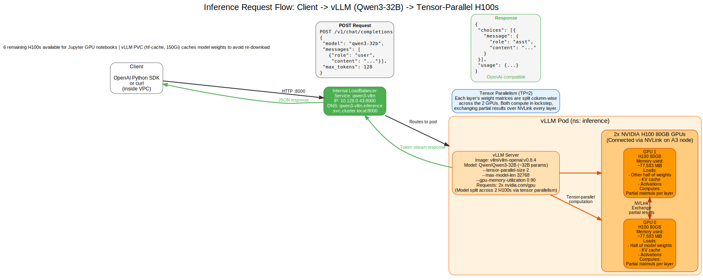

# Inference Endpoint User Guide — Qwen3-32B via vLLM

**Audience:** Engineers and technical staff who want to use the Qwen3-32B inference endpoint for generating text, answering questions, or building applications.

**What this guide covers:** How to call the vLLM inference API (curl, Python, streaming), understand the endpoint's capabilities, and troubleshoot common issues.

**Prerequisites:** Basic familiarity with REST APIs and Python. No GPU or Kubernetes knowledge required.

> **New to the terminology?** Terms like vLLM, Qwen3-32B, and OpenAI-compatible API are defined in the **[Glossary appendix](appendix-glossary.md)**.

---

## Table of Contents

1. [What the Endpoint Is](#1-what-the-endpoint-is)
2. [How to Reach the Endpoint](#2-how-to-reach-the-endpoint)
3. [List Available Models](#3-list-available-models)
4. [Chat Completion with curl](#4-chat-completion-with-curl)
5. [Chat Completion with Python OpenAI SDK](#5-chat-completion-with-python-openai-sdk)
6. [Streaming Responses](#6-streaming-responses)
7. [Common Parameters](#7-common-parameters)
8. [Using from a Jupyter Notebook](#8-using-from-a-jupyter-notebook)
9. [Troubleshooting](#9-troubleshooting)

---

## 1. What the Endpoint Is

The inference endpoint is a **vLLM** server that serves the **Qwen3-32B** language model (a 32-billion-parameter open-weights model) via an **OpenAI-compatible API**.



**Figure 1: Inference request flow.** A user sends an HTTP request (curl or Python OpenAI client) to the internal load balancer. The request routes to the vLLM pod running on an A3 node with H100 GPUs. The pod processes the request using 2 GPUs in tensor-parallel mode and returns the generated text.

### Key details

- **Model served:** `Qwen/Qwen3-32B` (from Hugging Face, ungated)
- **Model name to use in API calls:** `qwen3-32b`
- **API compatibility:** OpenAI-compatible `/v1/chat/completions` and `/v1/models` endpoints
- **Public endpoint (HTTPS):** `https://infer.136.69.110.10.nip.io/v1`
- **In-cluster DNS name:** `qwen3-vllm.inference.svc.cluster.local:8000` (for notebooks/pods in the cluster)
- **Maximum context length:** 32,768 tokens
- **API key: REQUIRED.** Every request must carry `Authorization: Bearer <key>` (OpenAI client: `api_key="<key>"`). **Ask your admin for the key** — it's stored in the `vllm-api-key` Kubernetes secret.

### Access

The endpoint is reachable two ways, both requiring the API key:

- **Public HTTPS (for the team):** `https://infer.136.69.110.10.nip.io/v1` — works from anywhere, no VPC access or `kubectl` needed.
- **In-cluster:** notebooks and pods use the DNS name `qwen3-vllm.inference.svc.cluster.local:8000` (see [Section 8](#8-using-from-a-jupyter-notebook)).

---

## 2. How to Reach the Endpoint

### (a) Public HTTPS endpoint (recommended, for the team)

From anywhere — no VPC access or `kubectl` needed. Use the HTTPS URL plus the API key:

```
https://infer.136.69.110.10.nip.io/v1
```

Every request must include `Authorization: Bearer <API_KEY>` (the OpenAI client sends this automatically when you set `api_key`). Get the key from your admin.

### (b) From a Jupyter notebook in-cluster

Notebooks running in the JupyterHub environment (namespace `jupyter`) can use the in-cluster DNS name:

```
http://qwen3-vllm.inference.svc.cluster.local:8000
```

See [Section 8](#8-using-from-a-jupyter-notebook) for a complete notebook example.

### (c) From your laptop (outside the VPC)

If you're developing from your laptop and need to test the endpoint, use `kubectl port-forward`:

```bash
# Forward local port 8000 to the vLLM service in the cluster
kubectl -n inference port-forward svc/qwen3-vllm 8000:8000
```

Leave this running in a terminal, then use `http://localhost:8000` in your code or curl commands.

**Note:** You'll need cluster credentials configured:

```bash
gcloud container clusters get-credentials hypercomputer-a3-cluster \
  --region us-central1 --project hdlab-elideng
```

---

## 3. List Available Models

To see the model(s) served by the endpoint:

```bash
curl https://infer.136.69.110.10.nip.io/v1/models \
  -H "Authorization: Bearer $VLLM_API_KEY"
```

**Sample output:**

```json
{
  "object": "list",
  "data": [
    {
      "id": "qwen3-32b",
      "object": "model",
      "created": 1784284247,
      "owned_by": "vllm",
      "root": "Qwen/Qwen3-32B",
      "max_model_len": 32768
    }
  ]
}
```

The `id` field (`"qwen3-32b"`) is the model name you'll use in chat completion requests.

---

## 4. Chat Completion with curl

### Basic request

```bash
curl https://infer.136.69.110.10.nip.io/v1/chat/completions \
  -H "Authorization: Bearer $VLLM_API_KEY" \
  -H 'Content-Type: application/json' \
  -d '{
    "model": "qwen3-32b",
    "messages": [
      {"role": "user", "content": "Explain tensor parallelism in one sentence."}
    ],
    "max_tokens": 64
  }'
```

### Sample JSON response

```json
{
  "id": "chatcmpl-971f5573976c4b7ca0aecc292c892e86",
  "object": "chat.completion",
  "model": "qwen3-32b",
  "choices": [
    {
      "index": 0,
      "message": {
        "role": "assistant",
        "content": "<think>\nOkay, the user wants me to explain tensor parallelism in one sentence. Tensor parallelism is a technique where a large neural network model is split across multiple GPUs by dividing the weight matrices of each layer, allowing the GPUs to compute in parallel and exchange partial results over high-speed interconnects like NVLink.\n</think>\n\nTensor parallelism is a technique that splits a model's weight matrices across multiple GPUs so they compute in lockstep and exchange partial results, enabling faster inference for large models."
      },
      "finish_reason": "stop"
    }
  ],
  "usage": {
    "prompt_tokens": 15,
    "total_tokens": 79,
    "completion_tokens": 64
  }
}
```

**Note on Qwen3 `<think>` tags:** Qwen3-32B often includes reasoning in `<think>` tags before the final answer. This is expected behavior. You can parse out the final answer or adjust your prompt to request concise responses.

---

## 5. Chat Completion with Python OpenAI SDK

Install the OpenAI client if you haven't already:

```bash
pip install openai
```

### Basic example

```python
from openai import OpenAI

# Public HTTPS endpoint + API key (ask your admin for the key)
import os
client = OpenAI(
    base_url="https://infer.136.69.110.10.nip.io/v1",
    api_key=os.environ["VLLM_API_KEY"],   # or paste the key string directly
)

# Send a chat completion request
response = client.chat.completions.create(
    model="qwen3-32b",
    messages=[
        {"role": "user", "content": "What is 2+2?"}
    ],
    max_tokens=20
)

# Print the assistant's reply
print(response.choices[0].message.content)
```

**Sample output:**

```
<think>
Okay, so I need to figure out what 2 plus 2 is. Let me
```

(Truncated at `max_tokens=20`. Increase `max_tokens` for longer responses.)

### Adding a system prompt

```python
response = client.chat.completions.create(
    model="qwen3-32b",
    messages=[
        {"role": "system", "content": "You are a helpful assistant. Be concise."},
        {"role": "user", "content": "What is tensor parallelism?"}
    ],
    max_tokens=128
)

print(response.choices[0].message.content)
```

### Multi-turn conversation

```python
messages = [
    {"role": "system", "content": "You are a helpful assistant."},
    {"role": "user", "content": "What is the capital of France?"},
]

response = client.chat.completions.create(
    model="qwen3-32b",
    messages=messages,
    max_tokens=64
)

# Add assistant's reply to history
messages.append({
    "role": "assistant",
    "content": response.choices[0].message.content
})

# Continue the conversation
messages.append({"role": "user", "content": "What is its population?"})

response = client.chat.completions.create(
    model="qwen3-32b",
    messages=messages,
    max_tokens=64
)

print(response.choices[0].message.content)
```

---

## 6. Streaming Responses

For long responses, you can stream tokens as they're generated instead of waiting for the complete response:

```python
from openai import OpenAI

client = OpenAI(
    base_url="https://infer.136.69.110.10.nip.io/v1",
    api_key=os.environ["VLLM_API_KEY"],
)

stream = client.chat.completions.create(
    model="qwen3-32b",
    messages=[
        {"role": "user", "content": "Write a short story about a robot learning to paint."}
    ],
    max_tokens=256,
    stream=True  # Enable streaming
)

for chunk in stream:
    if chunk.choices[0].delta.content is not None:
        print(chunk.choices[0].delta.content, end="", flush=True)

print()  # Newline at the end
```

**Sample output:**

```
<think>
Okay, so I need to write a short story about a robot learning to paint...
</think>

Once upon a time, in a quiet studio...
```

Tokens appear as they're generated, providing a better user experience for interactive applications.

---

## 7. Common Parameters

Here are the most commonly used parameters for the `/v1/chat/completions` endpoint:

| Parameter | Type | Default | Description |
|-----------|------|---------|-------------|
| `model` | string | *required* | Model name. Use `"qwen3-32b"`. |
| `messages` | array | *required* | List of message objects with `role` (`"system"`, `"user"`, `"assistant"`) and `content`. |
| `max_tokens` | integer | (unlimited) | Maximum number of tokens to generate. Cap this to control response length and latency. |
| `temperature` | float | 1.0 | Sampling temperature. Lower (e.g., 0.2) = more deterministic. Higher (e.g., 1.5) = more creative/random. |
| `top_p` | float | 1.0 | Nucleus sampling. Keep top tokens whose cumulative probability is `top_p`. Use 0.9 for slightly more focused responses. |
| `stream` | boolean | false | If `true`, stream response tokens as they're generated (see [Section 6](#6-streaming-responses)). |
| `stop` | string or array | null | Stop generation when these tokens are encountered (e.g., `["</think>"]` to stop at the end of reasoning). |

### Example with multiple parameters

```python
response = client.chat.completions.create(
    model="qwen3-32b",
    messages=[
        {"role": "system", "content": "You are a concise assistant."},
        {"role": "user", "content": "Explain GPUs."}
    ],
    max_tokens=100,
    temperature=0.7,
    top_p=0.9
)

print(response.choices[0].message.content)
```

---

## 8. Using from a Jupyter Notebook

If you're working in a Jupyter notebook spawned by the in-cluster JupyterHub (see the [Jupyter Notebook User Guide](04-jupyter-notebook-user-guide.md)), you can call the inference endpoint using the in-cluster DNS name.

**Example notebook:** See `deploy/jupyter/examples/call_vllm.ipynb` for a working example.

### In a notebook cell

```python
from openai import OpenAI

client = OpenAI(
    base_url="http://qwen3-vllm.inference.svc.cluster.local:8000/v1",
    api_key=os.environ["VLLM_API_KEY"]   # required now; ask your admin for the key
)

response = client.chat.completions.create(
    model="qwen3-32b",
    messages=[{"role": "user", "content": "Hello, how are you?"}],
    max_tokens=64
)

print(response.choices[0].message.content)
```

**Why use the DNS name instead of the IP?** The DNS name (`qwen3-vllm.inference.svc.cluster.local`) works across Kubernetes namespaces and will continue to work even if the load balancer IP changes.

---

## 9. Troubleshooting

### Problem: Connection refused or timeout

**Symptoms:**

```
requests.exceptions.ConnectionError: ('Connection aborted.', ConnectionRefusedError(111, 'Connection refused'))
```

or

```
curl: (7) Failed to connect to infer.136.69.110.10.nip.io port 443: Connection refused
```

**Possible causes and fixes:**

| Cause | How to check | Fix |
|-------|--------------|-----|
| Wrong URL | Verify you're using `https://infer.136.69.110.10.nip.io/v1` (public) or `qwen3-vllm.inference.svc.cluster.local:8000` (in-cluster) | Double-check the base URL in your code |
| TLS cert not ready yet | `curl -v` shows a certificate error | The Google-managed cert can take 10–60 min after first setup; retry, or ask your admin to check `managedcertificate vllm-cert` |
| vLLM pod is down | (Admin) `kubectl -n inference get pods -l app=qwen3-vllm` | Wait for the pod to be `Running`/`Ready`; across the 7-day node rotation expect brief unavailability |

### Problem: 401 Unauthorized

**Symptom:** `{"error":{"message":"...","code":401}}` or an HTTP 401.

**Cause:** Missing or wrong API key — the endpoint now **requires** one.

**Fix:** Send `Authorization: Bearer <key>` (OpenAI client: set `api_key`). Get the key from your admin (it lives in the `vllm-api-key` secret). Example: `export VLLM_API_KEY=<key>` then retry.

### Problem: "Model not found" or 404 error

**Symptoms:**

```json
{"error": "Model not found: qwen3-32B"}
```

**Cause:** The model name is case-sensitive. The correct name is `qwen3-32b` (lowercase "b").

**Fix:** Use `"qwen3-32b"` in the `model` field.

```python
# Wrong
response = client.chat.completions.create(model="qwen3-32B", ...)

# Correct
response = client.chat.completions.create(model="qwen3-32b", ...)
```

### Problem: Slow first token (TTFT)

**Symptoms:** First response from the model takes 5-10+ seconds, but subsequent requests are faster.

**Cause:** Cold start. The vLLM server may need to warm up the model or allocate GPU memory on the first request after a pod restart.

**Fix:** This is expected behavior. Subsequent requests will have much lower latency (typically <1s for short prompts). For production, consider keeping the pod "warm" with periodic health checks or a low-rate background request.

### Problem: Context length exceeded

**Symptoms:**

```json
{"error": "Input too long: ... tokens exceeds maximum context length of 32768"}
```

**Cause:** The sum of your prompt tokens and `max_tokens` exceeds the model's maximum context length of **32,768 tokens**.

**Fix:**

- Reduce the length of your prompt (fewer messages, shorter content)
- Reduce `max_tokens` to leave more room for the prompt
- Summarize or truncate conversation history in multi-turn chats

**Rough estimate:** 1 token ≈ 4 characters (or 0.75 words) in English. A 10,000-character prompt is approximately 2,500 tokens.

### Problem: Response is truncated or incomplete

**Symptoms:** The response ends abruptly; `finish_reason` is `"length"` instead of `"stop"`.

**Cause:** The response hit the `max_tokens` limit before the model finished generating.

**Fix:** Increase `max_tokens` in your request:

```python
response = client.chat.completions.create(
    model="qwen3-32b",
    messages=[...],
    max_tokens=512  # Increase from default
)
```

### Problem: Unexpected `<think>` tags in output

**Symptoms:** The model includes reasoning in `<think>...</think>` tags before the final answer.

**Cause:** Qwen3-32B is trained to show its reasoning process. This is **expected behavior**, not a bug.

**Fix (option 1):** Parse out the content after `</think>`:

```python
content = response.choices[0].message.content
if "</think>" in content:
    content = content.split("</think>", 1)[1].strip()
print(content)
```

**Fix (option 2):** Add a system prompt requesting concise responses:

```python
messages = [
    {"role": "system", "content": "Answer directly without showing reasoning."},
    {"role": "user", "content": "What is 2+2?"}
]
```

**Fix (option 3):** Use `stop=["</think>"]` to stop generation immediately after reasoning (though you'll lose the final answer).

---

## Related Guides

- **[Architecture Reference](01-architecture.md)** — Understand the full system: GKE cluster, GPU nodes, vLLM deployment, and networking
- **[Jupyter Notebook User Guide](04-jupyter-notebook-user-guide.md)** — Log into JupyterHub, launch GPU notebooks, and call the inference endpoint from a notebook
- **[Deployment from Scratch (Part 1 — start here)](02a-cluster-setup.md)** — The five-part series to deploy this infrastructure from a fresh GCP project
- **[Glossary appendix](appendix-glossary.md)** — Plain-language definitions of every term used in these guides

---

**Document version:** 2026-07-20  
**Endpoint details:** vLLM v0.8.4 serving Qwen3-32B at `https://infer.136.69.110.10.nip.io/v1` (public HTTPS, API-key gated). In-cluster: `qwen3-vllm.inference.svc.cluster.local:8000`.
